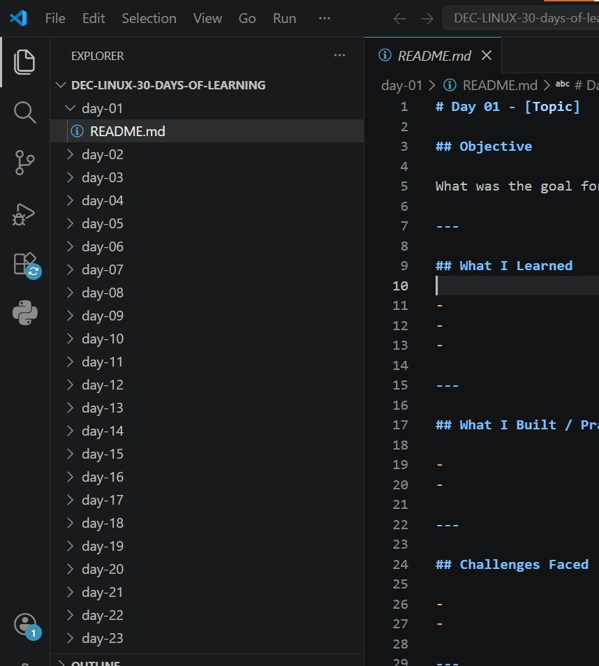
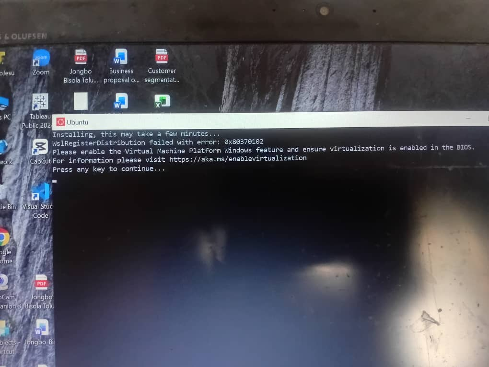
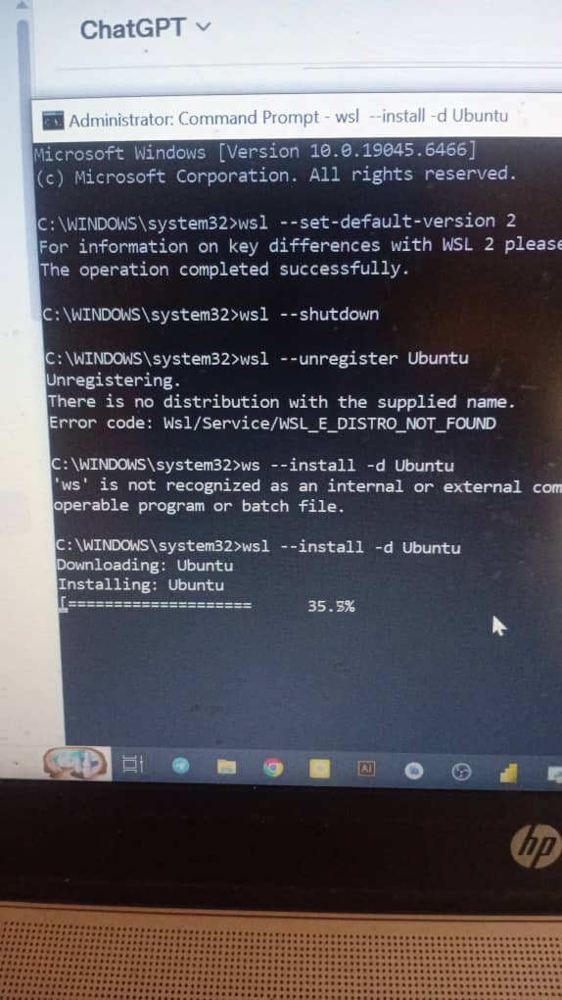
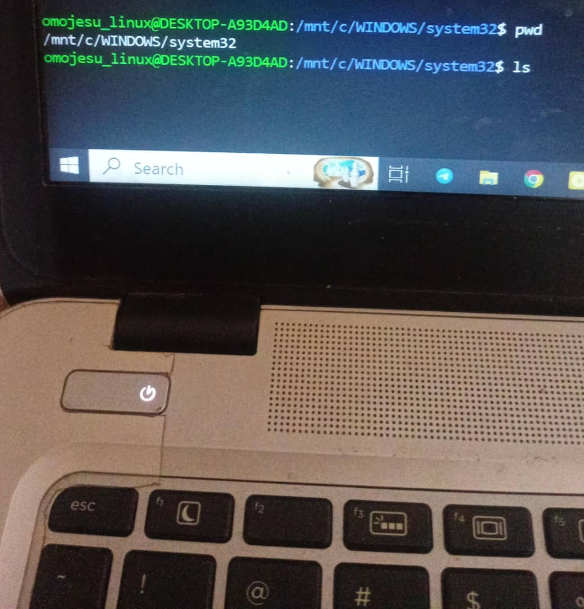

# Day 01 - [Linux Introduction/Fundemental,Installations and Repo clonning]

## Objective

What was the goal for today?
My objective was to understand Linux,Install vs code, Unbutun 

---

## What I Learned

- I learnt that Linux is based on the UNIX operating system
- Linux is free and open source.
- I learnt how to enable Virtual Machine Platform and check if it enable or Disable on  Windows 10
- I learnt to install git,Ubuntu and wsl extention on Vscode

- I learnt to login github on vscode and also how to fork and clone repo
---

## What I Built / Practiced

- Am still trying to understand wsl environment
-  I only ran two command pwd and ls

---

## Challenges Faced

- vscode was not opening when clicked on
-  Couldn't clone repo
- Virtual Machine Platform was disabled
- wsl was not working

---

## Key Takeaways

- The hours spent in fixing the challenges faced worth it
- I was able to learning something 

---

## Resources

- A friend,www.geeksforgeeks.org,ChatGpt,Youtube

---

## Output

(   )
