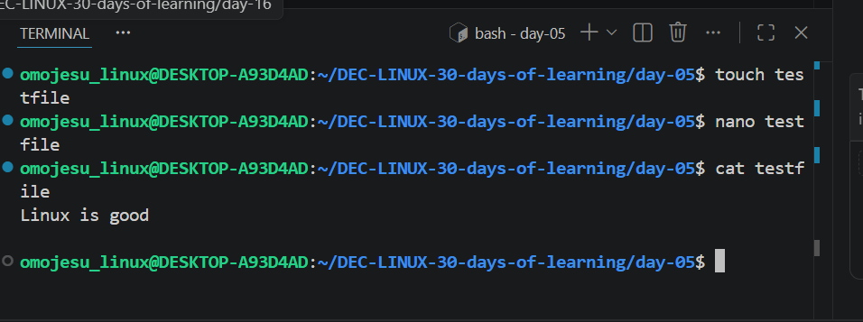

# Day 05 - [Editing and Viewing Files Linux]

## Objective
To understand how to edit and view files in Linux

---

## What I Learned

-  I learnt how to create multiples file at once using "touch"
- I learnt about cat command to display content and how to combine contents of two files into one
- I learnt about more command which view long files one page at a time.
- I also read about Linux Text editor

---

## What I Built / Practiced

- 
- 

---

## Challenges Faced

- None 
- 

---

## Key Takeaways

- As data engineer,you wil constantly interact with text files,scripts and logs
- 

---

## Resources

- 

---

## Output

