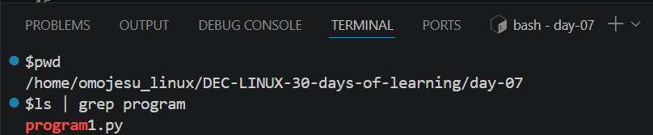
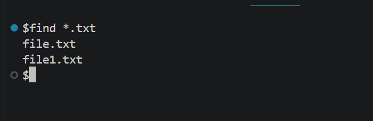
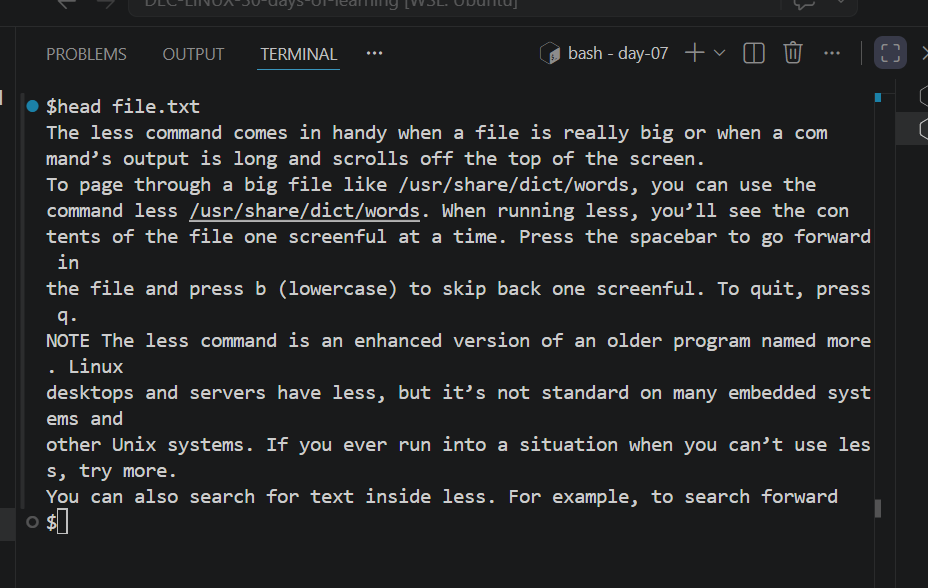
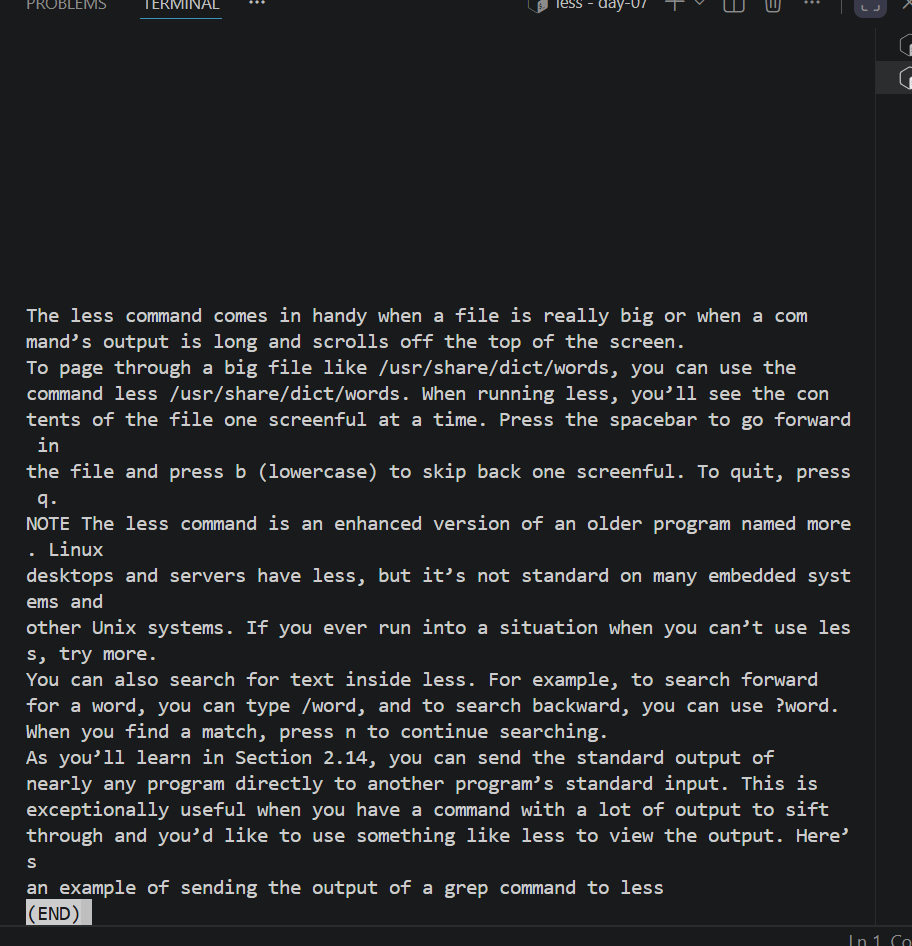

# Day 07 - [File Content Search and Text Processing]

## Objective

To understand command for searching and filtering text like grep,grep -i,grep -r and find

---

## What I Learned

- grep command is used to search for text
- grep -i command is used to search  for case insensitive 
- grep -r command is used to search recursive
- find command is used to locate files by name or type
- 

---

## What I Built / Practiced
- grep command 

- find command

- head command 

- less command

- 

- 
- 

---

## Challenges Faced

- I head challenge with grep command
- 

---

## Key Takeaways

- Understanding File Content Search content and Text Processing is key when handling datasets
- 

---

## Resources

- Mr Najeeb github learning resources

---

## Output
- 
Search for program file

-  
find command
