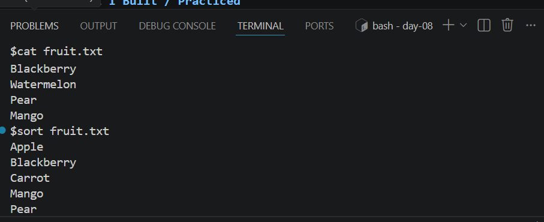
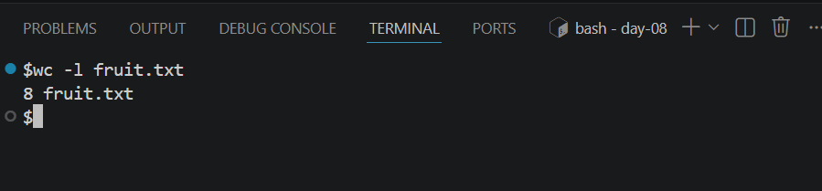
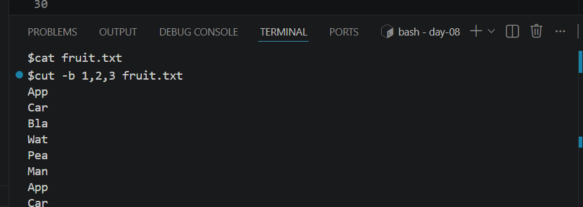

# Day 08 - [Sorting, Counting, and Filtering Data]

## Objective

To understand Sorting, Counting, and Filtering Data

---

## What I Learned

- I learnt about sort.This sort lines alphabetically
-  I learnt about uniq. This remove duplicate
-  I learnt about wc. This count lines/words/chars
-  I learnt about cut.Thi extract columns by delimiters 
-  I learnt about awk.This pattern scanning and reporting
-  I learnt about sed.This stream editor (search/replace)

---

## What I Built / Practiced

-  sort command

- wc -l command

- cut command

---

## Challenges Faced

- None
- 

---

## Key Takeaways

- As data engineers is important  we know Sorting, Counting, and Filtering Data
- 

---

## Resources
- github: https://github.com/Najeeb-Sulaiman/linux-and-bash-scripting-guide/blob/main/02-linux-commands/05-sorting-counting-and-filtering-data.md
- Video: https://www.youtube.com/watch?v=eHGCxEVlHd0

---

## Output
-  sort command

-  wc -l command

- cut command

