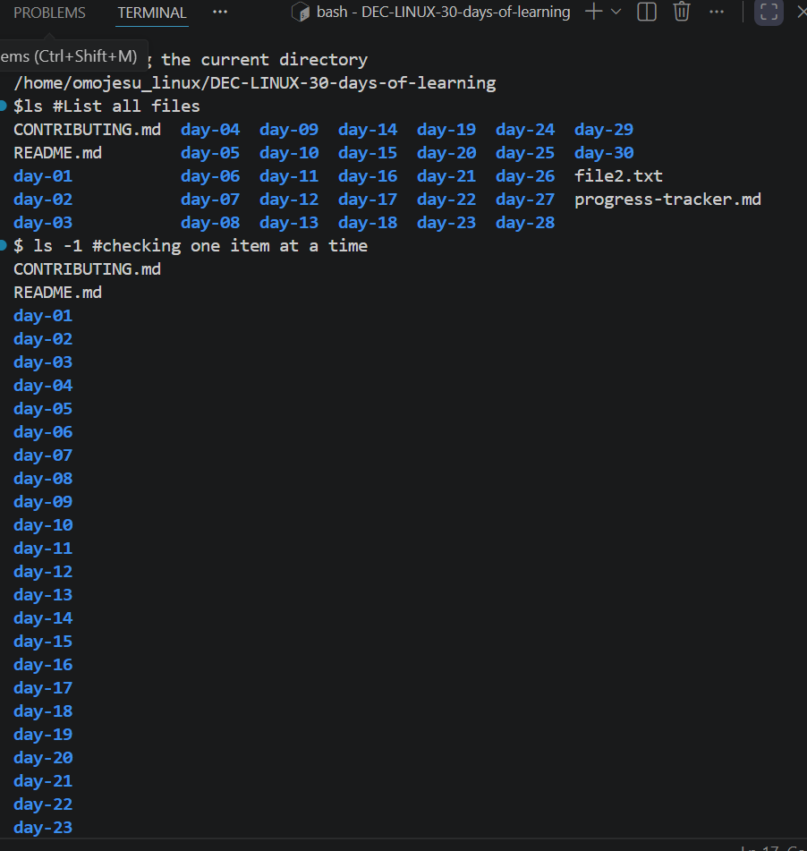
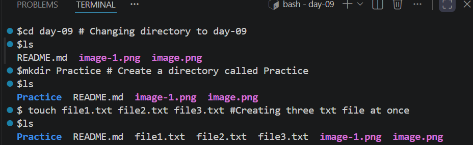
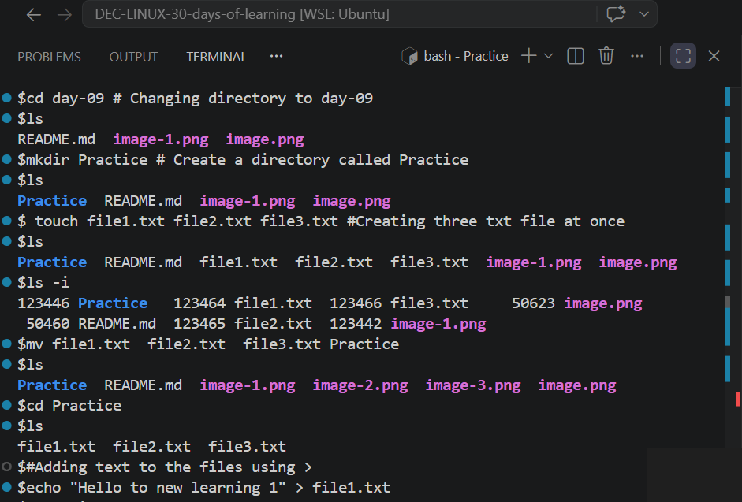
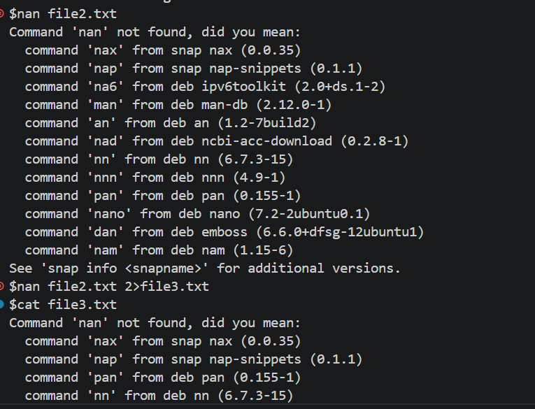
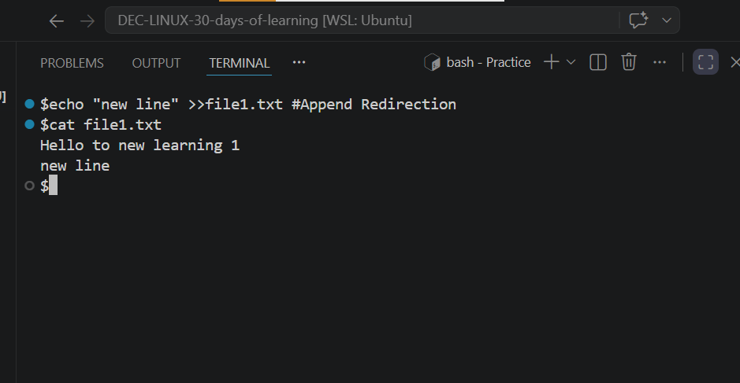
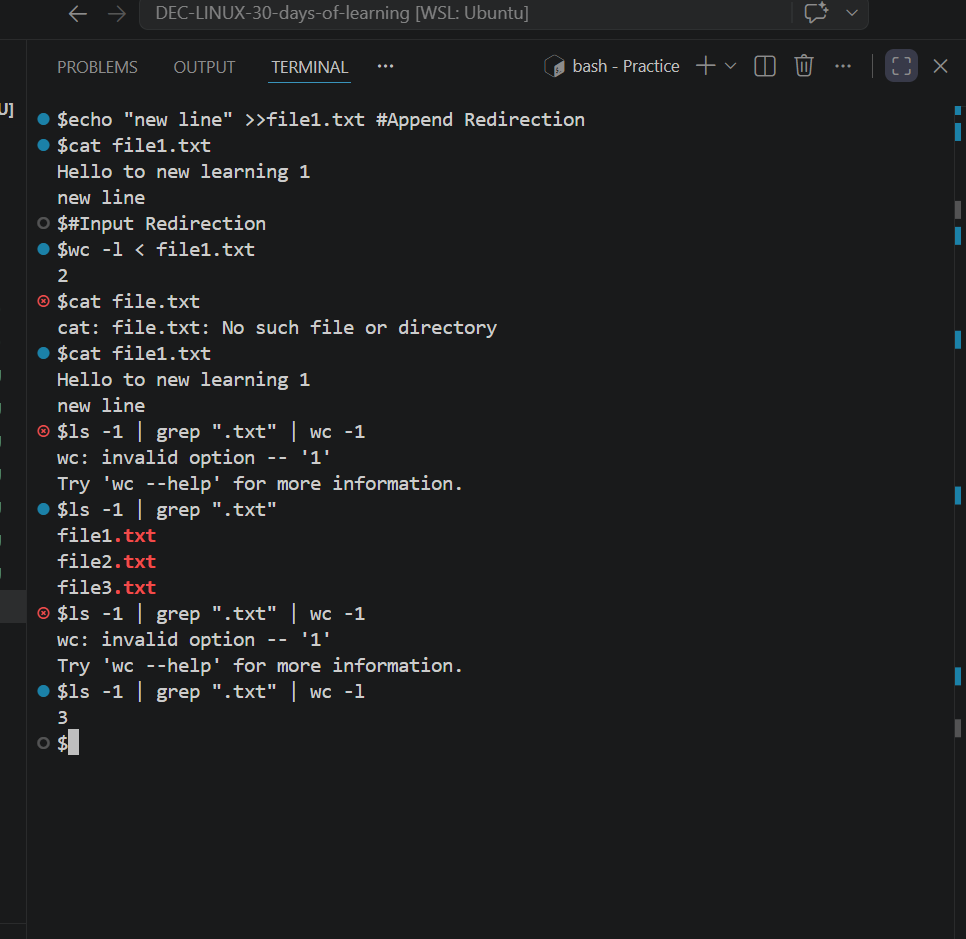

# Day 09 - [Redirection and Pipes]

## Objective

To understand how to use redirection and pipes in Linux to control the flow of data between commands ,files and the terminal

---

## What I Learned

- Standard Input(stdin):Usually from the keyboard
- Standard Output(stdout):Usually to the terminal screen
- Standard Erroe(stderr):Usually to the terminal screen
#  Common Redirection operators
- (>) Out Redirection:Overwrites a file with the command's Output
- (>>)Append Redirection:Appends output to the end of a file without erasing existing content
- (<) Input Redirection:Feeds a file's content as  input to a  command
- 2> Error Redirection:Redirects only error message to a file
- &> or 2>&1Merge Redirection :Redirect both stdout and stderr to the same destination

# PIPES(|)
- Pipes takes the stdout of one command and send it directly as stdin to another command
---

## What I Built / Practiced

- Checked Current directory am into
- Change directory
- Create directory 
- List all files
- Create a file
- Move file to Practice directory i created
- Read file content

---

## Challenges Faced

- Knowing how to use them
- 

---

## Key Takeaways

- (>>) Is usefully when you want keep an existing content
- (<) Is best when you want to replace a content
- Pipes(|) passes data through memory

---

## Resources

- github: https://github.com/Najeeb-Sulaiman/linux-and-bash-scripting-guide/blob/main/02-linux-commands/05-sorting-counting-and-filtering-data.md
- Youtube : geeksforgeeks channel

---

## Output

- 

