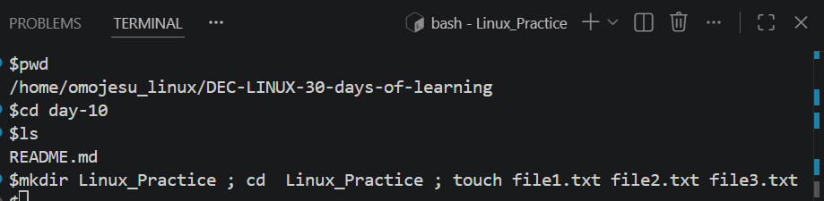
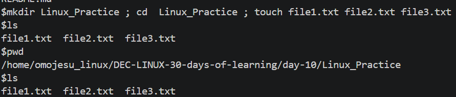
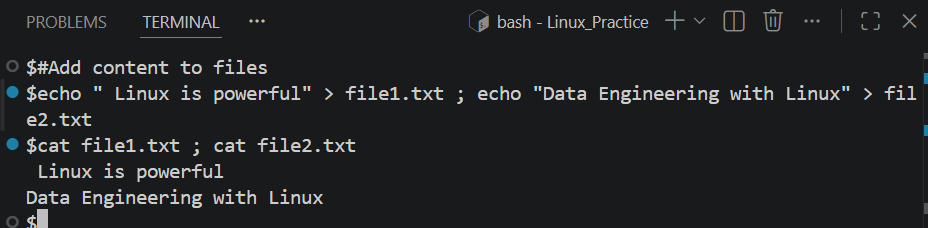
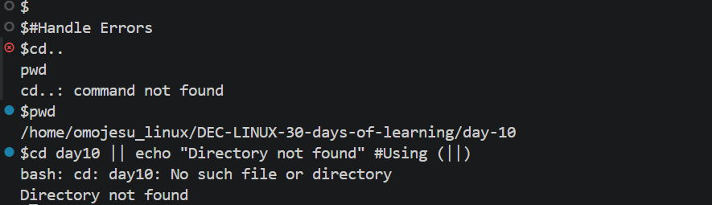
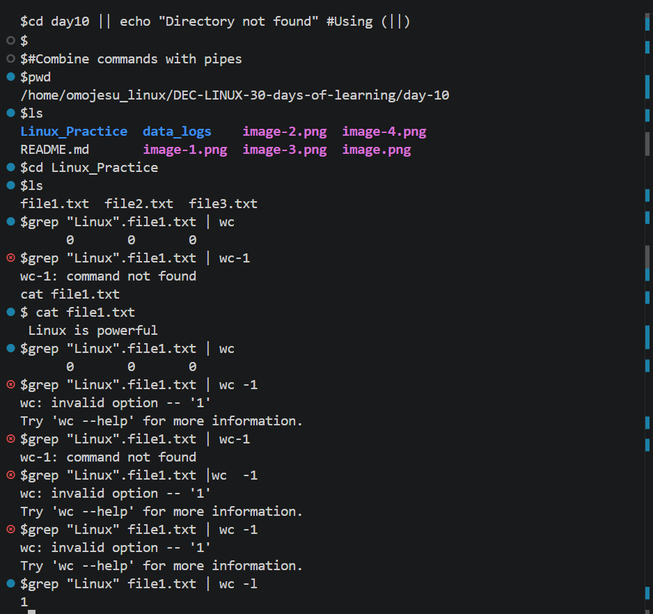
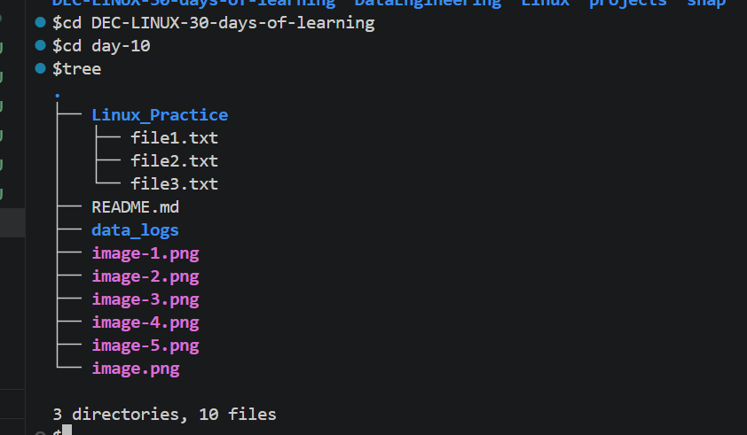

# Day 10 - [Chaining and Combining command in Linux ]

## Objective
To learn about Chaining and Combining command in Linux 

---

## What I Learned

- Chaining and combining commands in Linux allows multiple commands to be executed in one line, automating workflows and enhancing efficiency. Key operators include ; (sequential), && (dependent success), || (dependent failure), & (backgrounding), and | (piping output). These enable complex automation without manual intervention. 
- 
- 
- 

---

## What I Built / Practiced

- I create directory,navigate into the directoryb and create multiple files using semicolon(;)

-  Add content to files  and Display  both file content  using a single line with (;)

- Use the Ampersand(&&)

- Use the Double pipe(||)

---

## Challenges Faced

- None
- 

---

## Key Takeaways

- Automation & Efficiency: Chaining transforms multiple-step tasks into one-line commands, reducing the need for full shell scripts.
- Conditionality (&& vs ;): Use && for dependent commands (e.g., compile only if code saves) and ; for independent commands (e.g., clear logs, then check disk space).
- Data Processing with Pipes: Pipes (|) are essential for combining simple tools to perform complex data manipulation.
- Error Handling: Using && and || together creates if-else style logic directly on the command line.
- Productivity: Chaining reduces wait time and increases system management efficiency. 

---

## Resources

- github: https://github.com/Najeeb-Sulaiman/linux-and-bash-scripting-guide/blob/main/02-linux-commands/07-chaining-and-combining-commands.md

---

## Output
- [fig1](image.png)
- 
- 
- 
