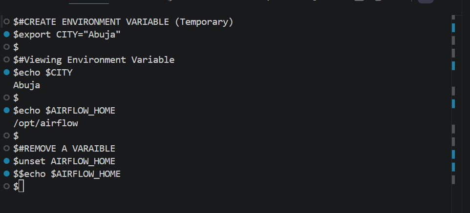
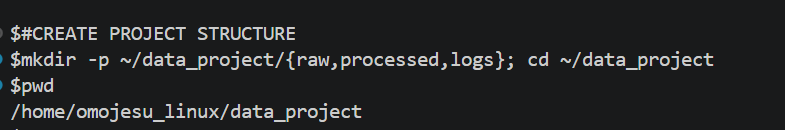
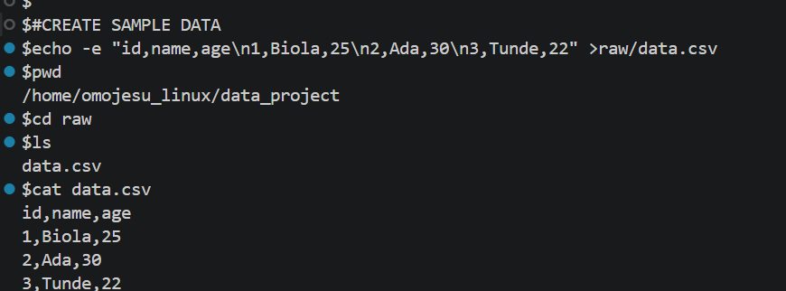
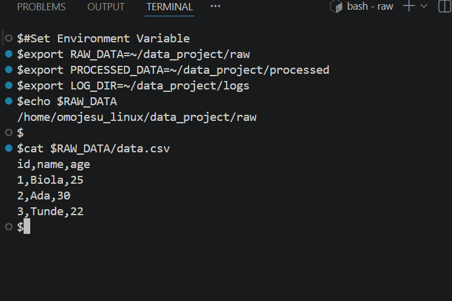

# Day 11 - [Environment Variables in Linux]

## Objective
To understand Environment Variables in Linux

---

## What I Learned

- Environment variables are used to store system or user- specific setting
- $echo $PATH - Show executable search path
-  export VAR =value - Set a variable
- env -List all environment variables
# Two types 
- Temporary -works only in current terminal session
- Permanent -saved in files like .bashrc

---

## What I Built / Practiced

- Created Environment Variable(Temporary)
$#CREATE ENVIRONMENT VARIABLE (Temporary)
$export CITY="Abuja"

- I learnt how to remove variable using "unset"

---

## Challenges Faced

- None

- 

---

## Key Takeaways

- They improve portability
- Temporary -works only in current terminal session
- Permanent -saved in files like .bashrc
- Used for security
- 

---

## Resources

- geeksforgeeks
-Learning Resources provided

---

## Output

