# Day 12 - [Practical Exercises]

## Objective
Is to  practice  exercises

---

## What I Learned

# Navigating the File System
- Print your current working directory.

- List all files and folders in the current directory:

Once normally
Once with one item per line
Once with detailed info (permissions, size, owner, etc.)
- Navigate to /etc (or any system directory), then:

Move up one level

Move up two levels

Return to your home directory

- Navigate to the root directory / and list its contents.

Use TAB autocompletion to type a directory path faster.

# Creating, Viewing, and Managing Files
- Create a folder called practice_files and navigate into it.

- Create three files at once.

- Add some text to each files.

- Combine the contents of all three files into one new file called all.txt.

- Display the content of the new file.

- Show the first 2 lines of all.txt.

- Open all.txt in a text editor.

- Append a text to the all.txt file.

- Overite the content of all.txt file with a new text.

# Copying, Moving, and Deleting
- Create a new directory named backup.

- Copy one of your text files into the backup folder.

- Copy the entire practice_files directory into a new folder called archive recursively.

- Rename a file inside archive

---

## What I Built / Practiced

- Navigating the File System
- Creating, Viewing, and Managing Files
- Copying, Moving, and Deleting

---

## Challenges Faced

- I had challenge in Copying the entire practice_files directory into a new folder called archive recursively.
- 

---

## Key Takeaways

- Practice makes you understand more
- 

---

## Resources

- https://github.com/Najeeb-Sulaiman/linux-and-bash-scripting-guide/blob/main/02-linux-commands/10-exercise.md

---

## Output

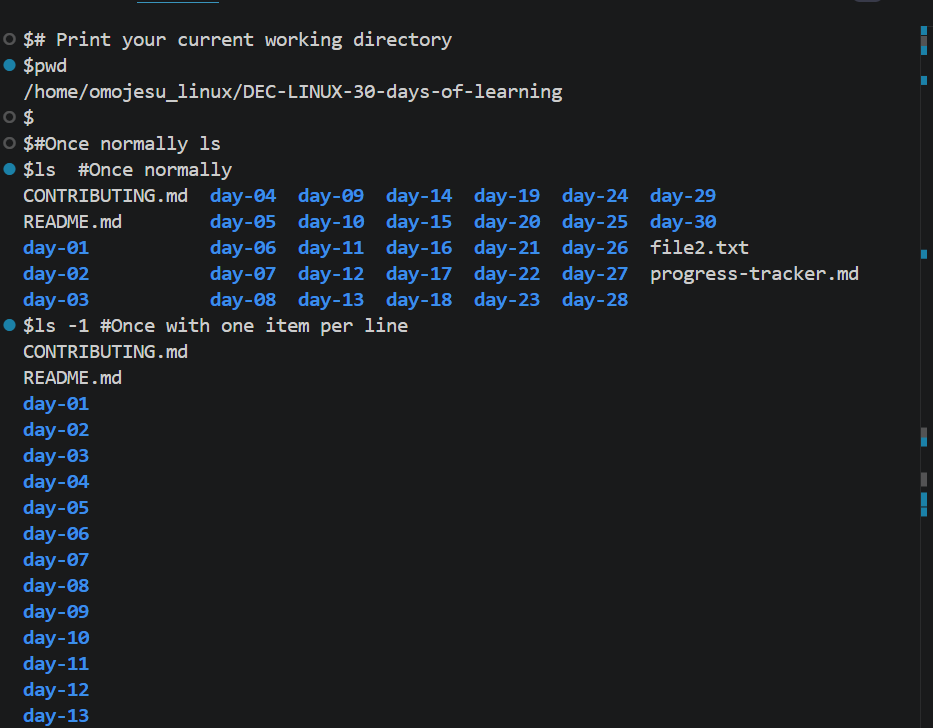
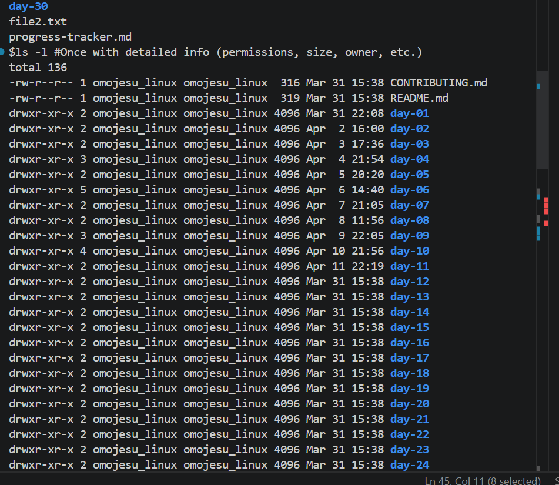
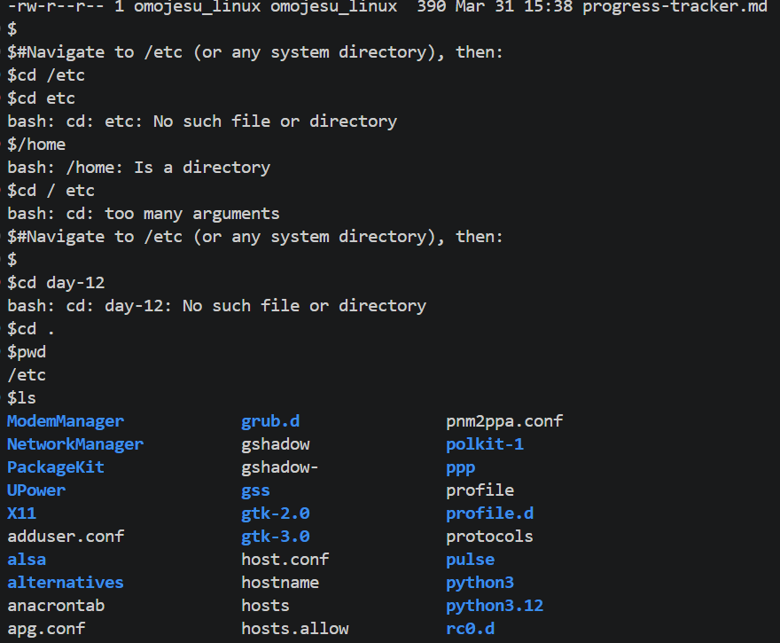
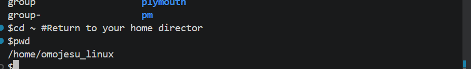
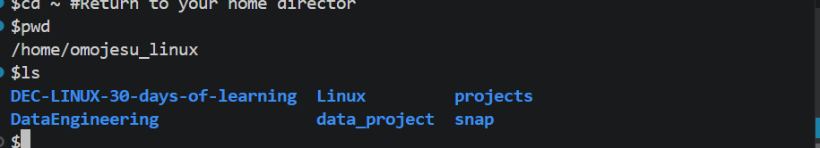
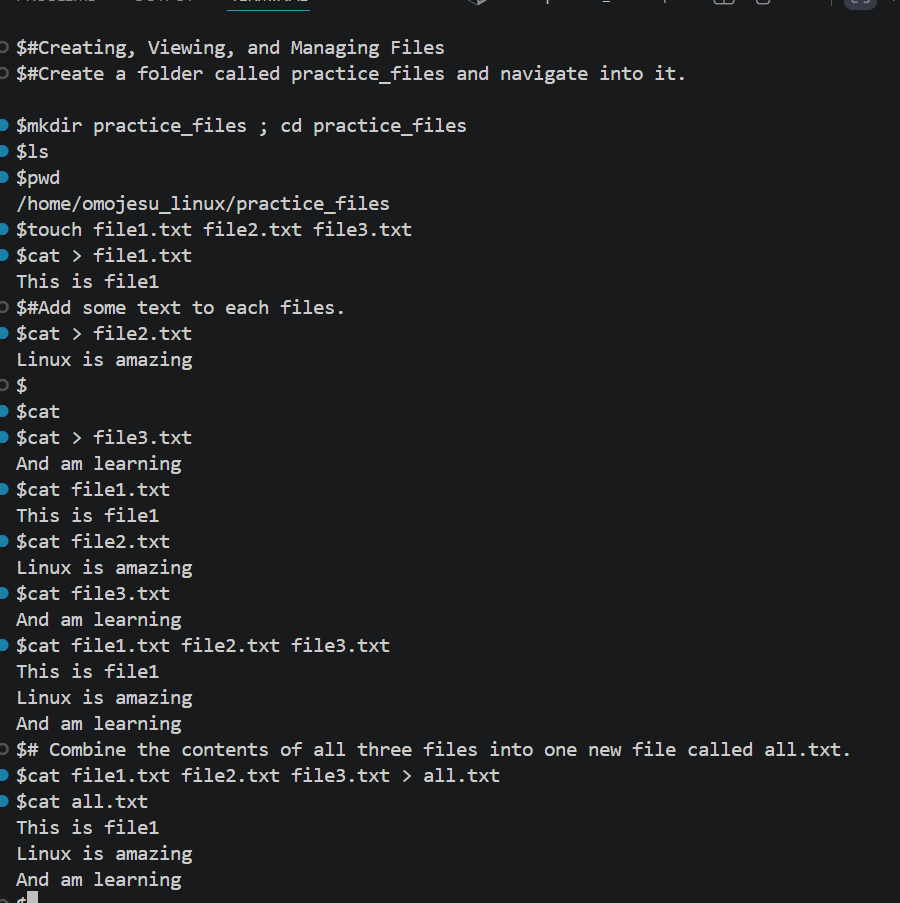
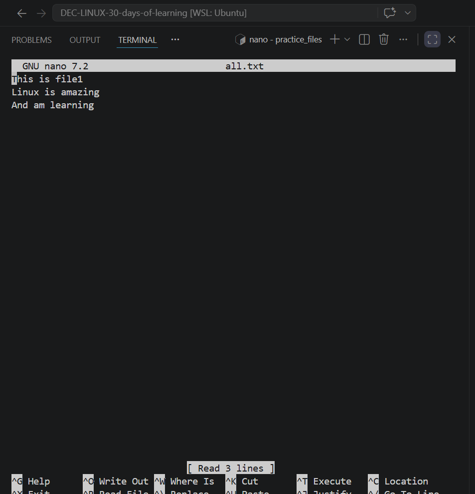
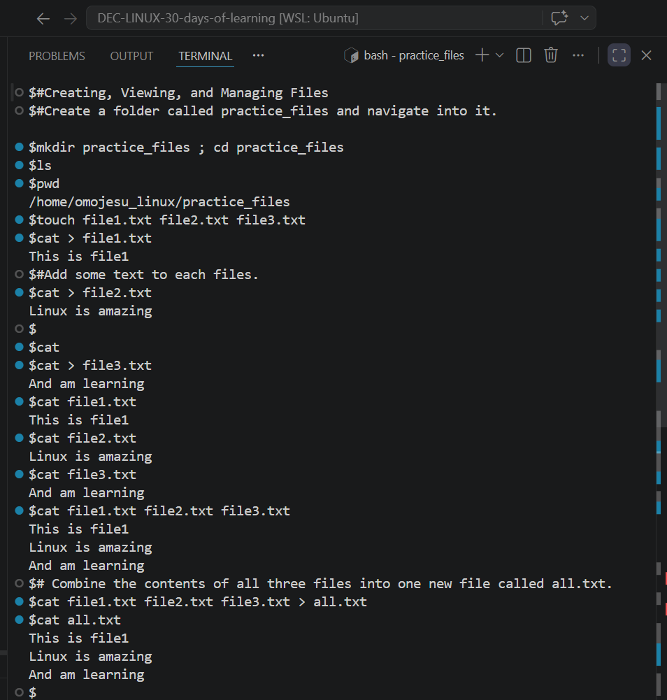
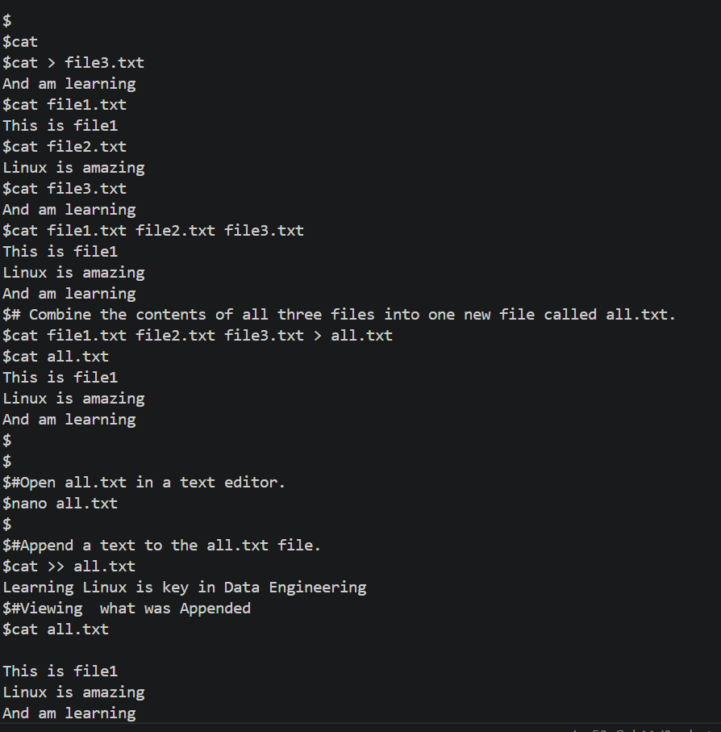
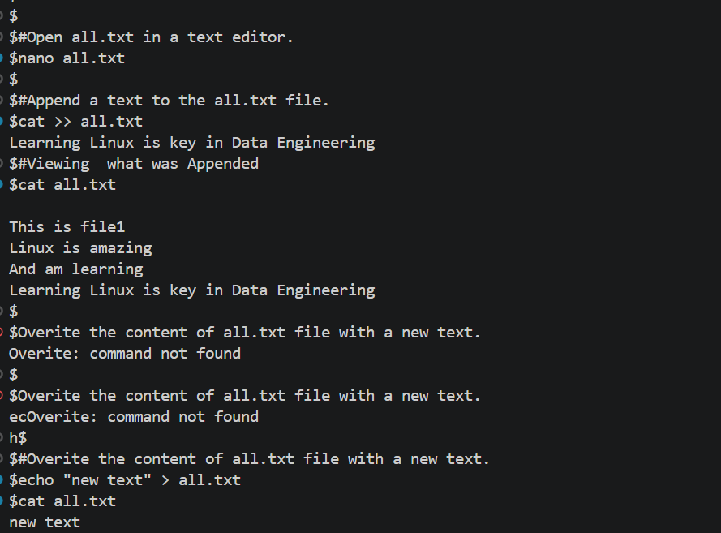
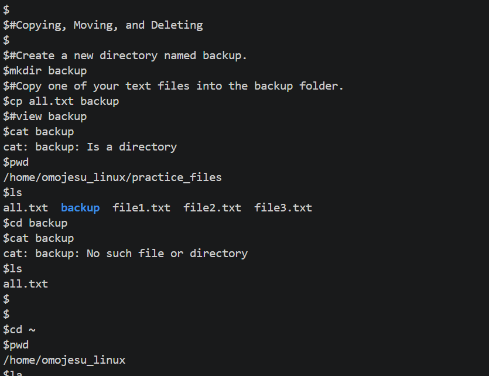
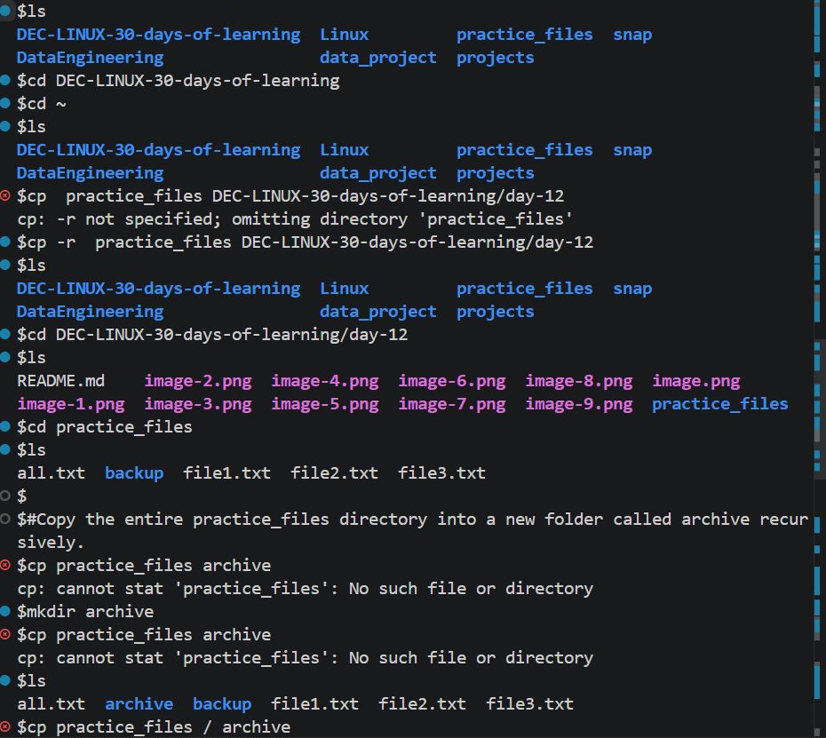
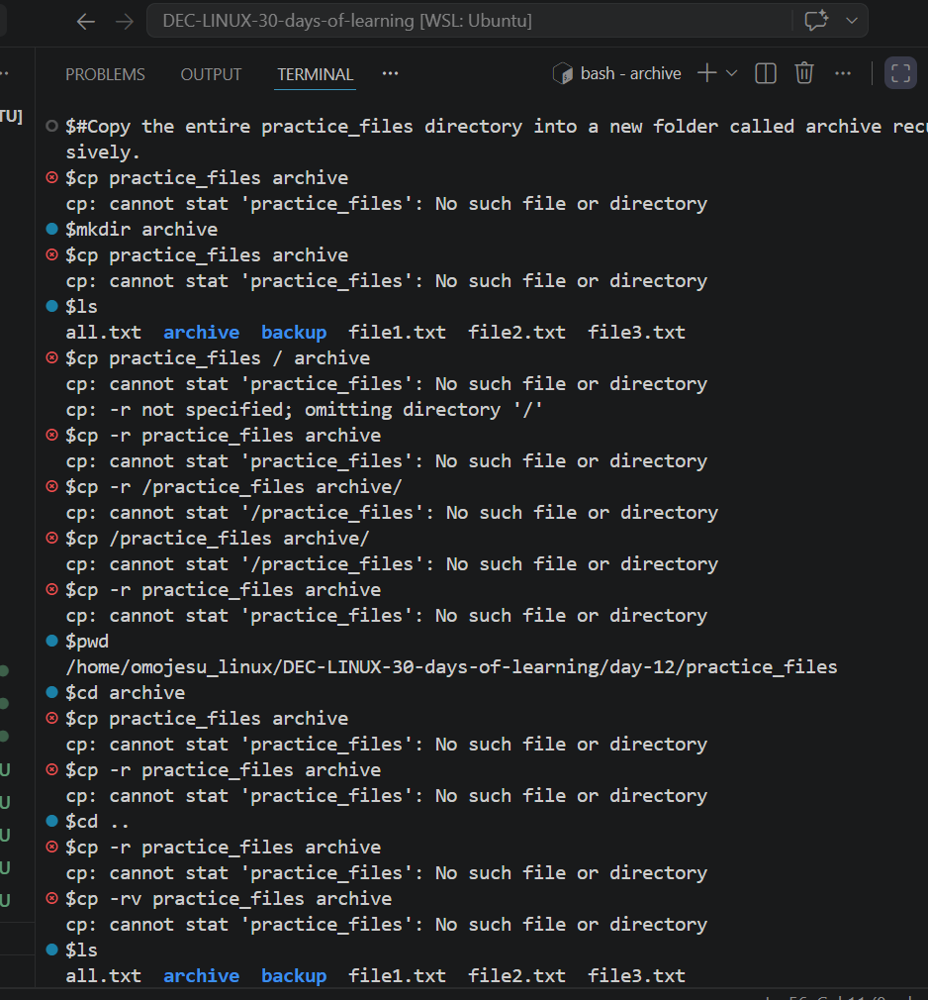