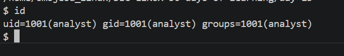
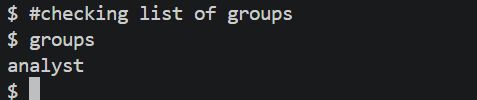

# Day 13 - [Users and Groups]

## Objective

I wants understand Users and Groups in Linux

---

## What I Learned

- Linux uses users and groups to assign this privileges which makes Linux a secure system by design

- User: This refers to a person or process account (e.g. root, ubuntu, airflow).

- Group: A collection of users with shared access rights.

- Root: The superuser with unrestricted control.

---

## What I Built / Practiced

- Display current user using whoami command
- Creates a new user (requires root)
- Sets or changes a user password
- Lists groups
- Shows user ID (UID), group ID (GID), and groups usind id command

---

## Challenges Faced

- 
- 

---

## Key Takeaways

- If you don't want to have a messed up system, you need to understand users and groups management
-

---

## Resources

- Github:https://github.com/Najeeb-Sulaiman/linux-and-bash-scripting-guide/blob/main/03-linux-user-management/01-users-and-groups.md

---

## Output

