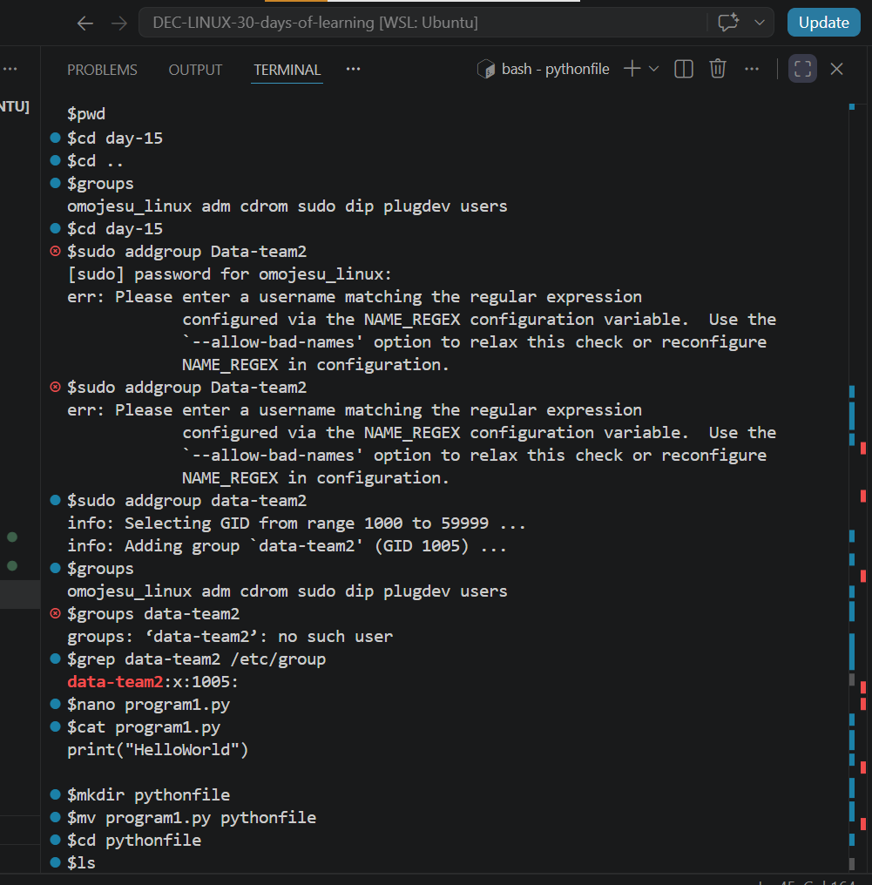
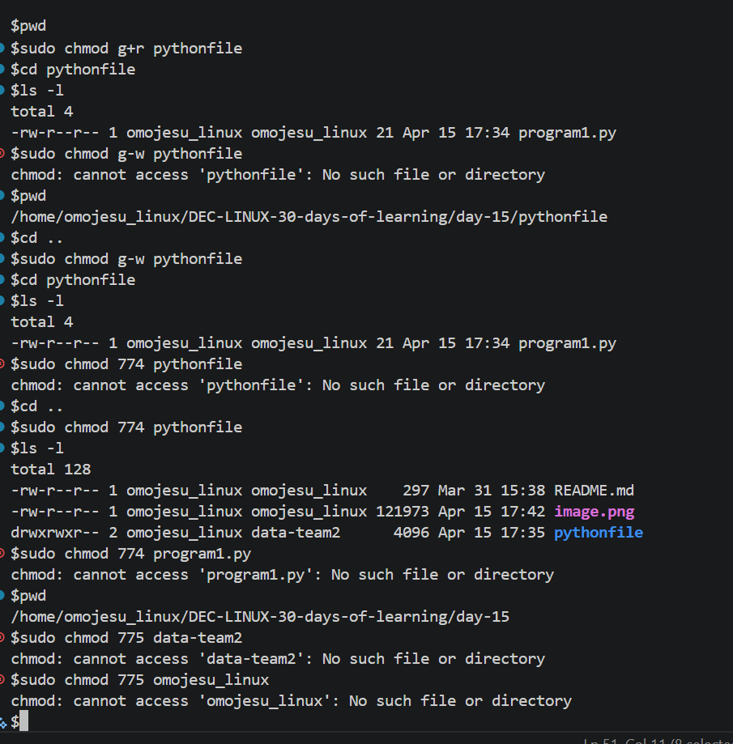
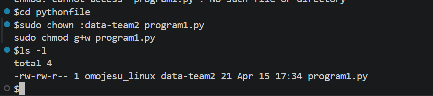
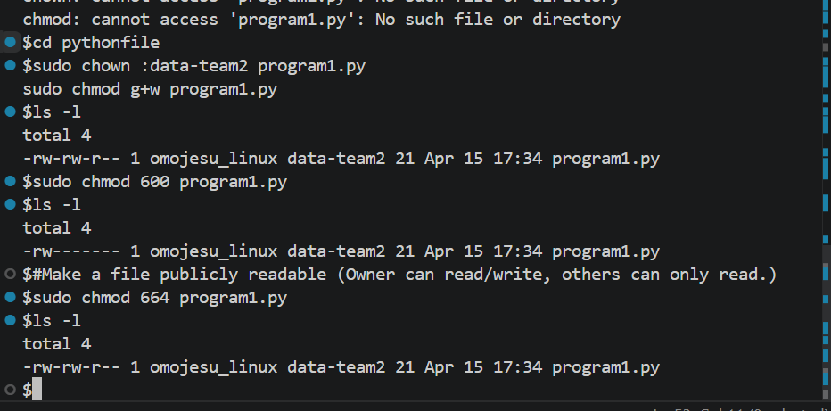

# Day 15 - [FILE PERMISSION AND OWNERSHIP]

## Objective

To understand File Permission and Ownership

---

## What I Learned

- what File Permission and Ownership means
- Types of Ownership 
- Types of Permission
- Permission Representation
- Two Types of Permission mode(Symbolic mode and Octal(numeric) mode
- Common Permissions
- How to change Ownership(chown)
- How to change mode (chmod)

---

## What I Built / Practiced

- Make a script executable
- Give a group write access to a directory
- Restrict access to a file completely (Only the owner can read/write.)
- Make a file publicly readable (Owner can read/write, others can only read.)
- 

---

## Challenges Faced

- Had issue adding a groupname because the name starts with uppercase
- Permission mode is kind of confusing

---

## Key Takeaways

- It important one understand the Permission Mode (Symbolic and Octal numeric mode) 
- 

---

## Resources

- Github : https://github.com/Najeeb-Sulaiman/linux-and-bash-scripting-guide/blob/main/04-linux-file-permissions-and-ownership/01-file-permissions-and-ownership.md 

---

## Output

