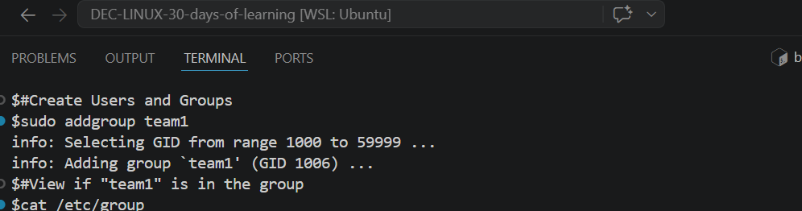
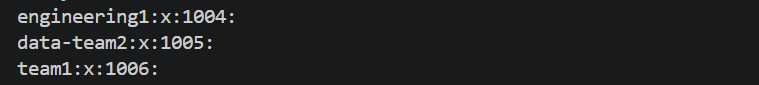
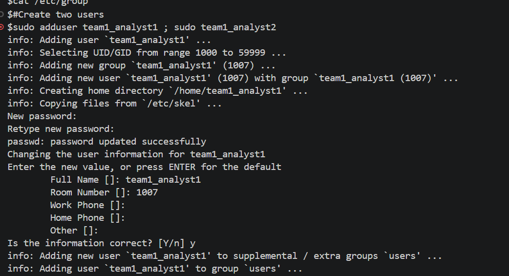
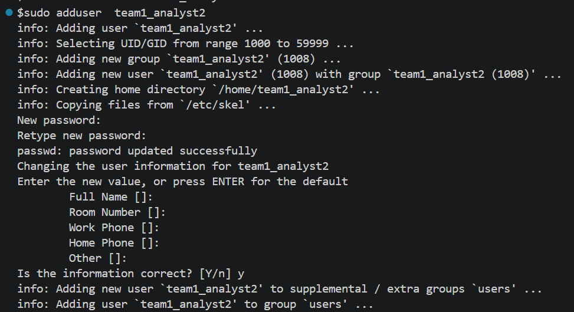
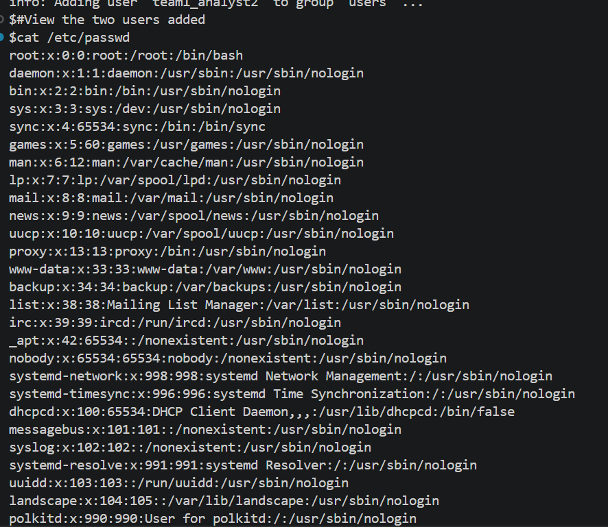
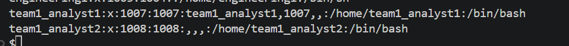
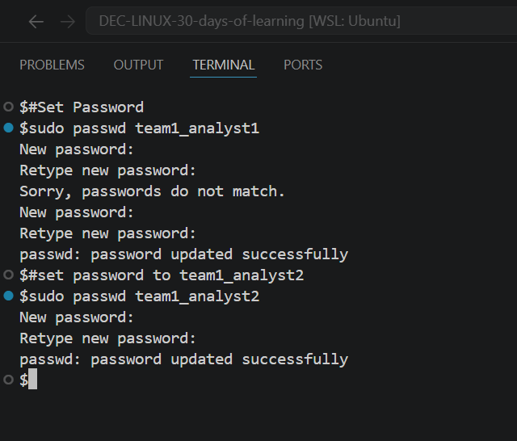
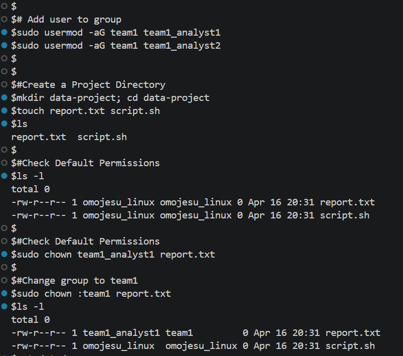
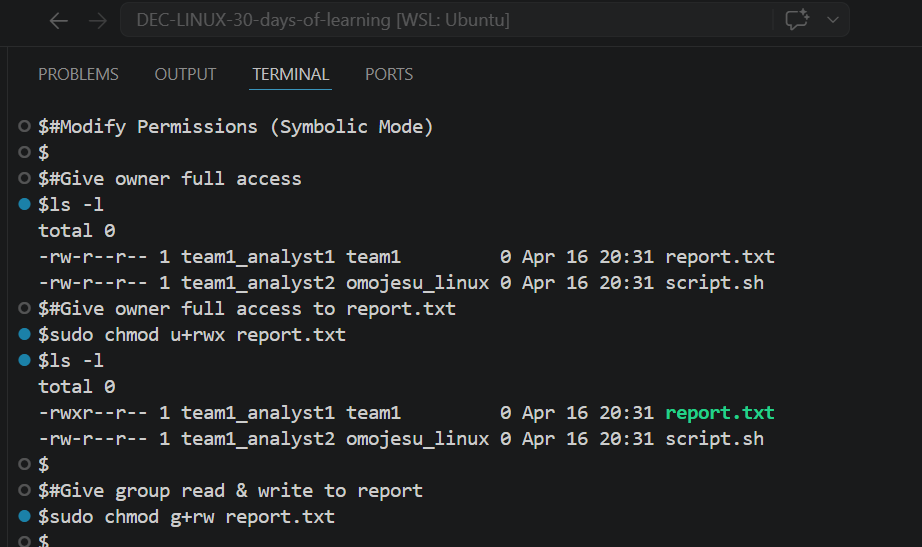

# Day 16 - [Practical Exercises]

## Objective

Is to  practice  more of Permission and Ownership

---

## What I Learned

- Create Users and Groups
- Create two users
- Set passwords
- Add users to the group
- Create a Project Directory
- Check Default Permissions
- Change Ownership
- Modify Permissions (Symbolic Mode)
- Modify Permissions (Numeric Mode)
- 

---

## What I Built / Practiced

- Create Users and Groups
- Create two users
- Set passwords
- Add users to the group
- Create a Project Directory
- Check Default Permissions
- Change Ownership
- Modify Permissions (Symbolic Mode)
- Modify Permissions (Numeric Mode)

---

## Challenges Faced
- Had issue with directory permission 
- 

---

## Key Takeaways

- It important one understand the Permission Mode (Symbolic and Octal numeric mode) 

---

## Resources

- Github : https://github.com/Najeeb-Sulaiman/linux-and-bash-scripting-guide/blob/main/04-linux-file-permissions-and-ownership/01-file-permissions-and-ownership.md 

---

## Output

