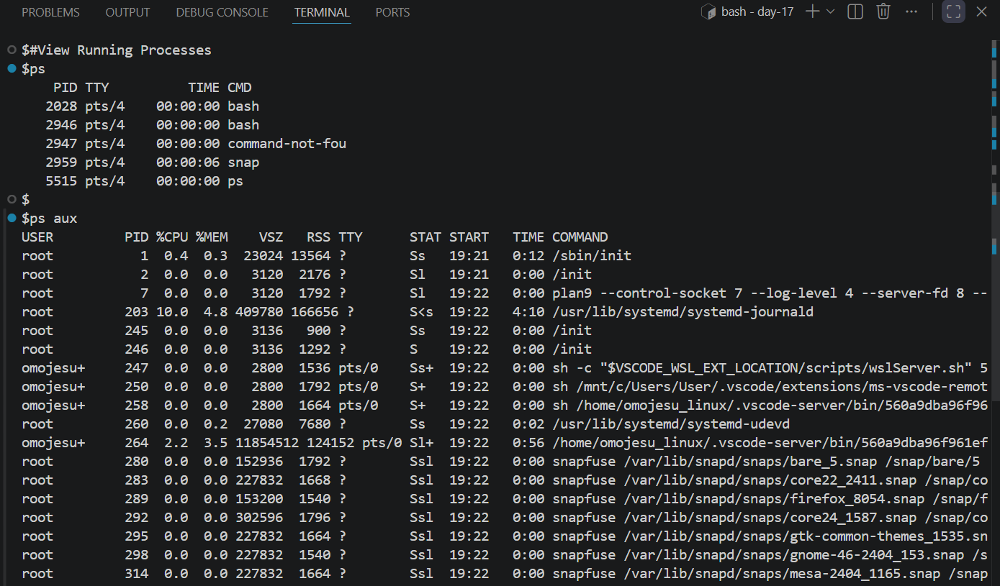
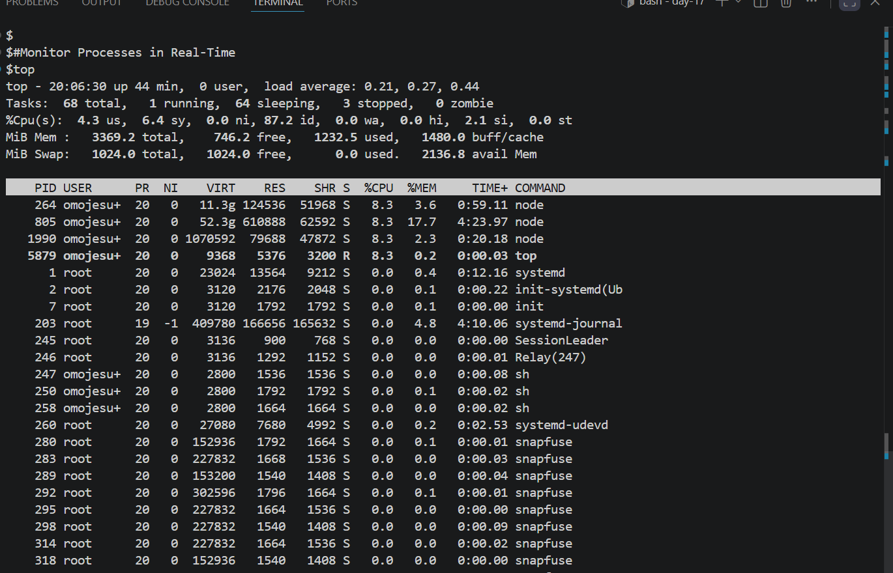
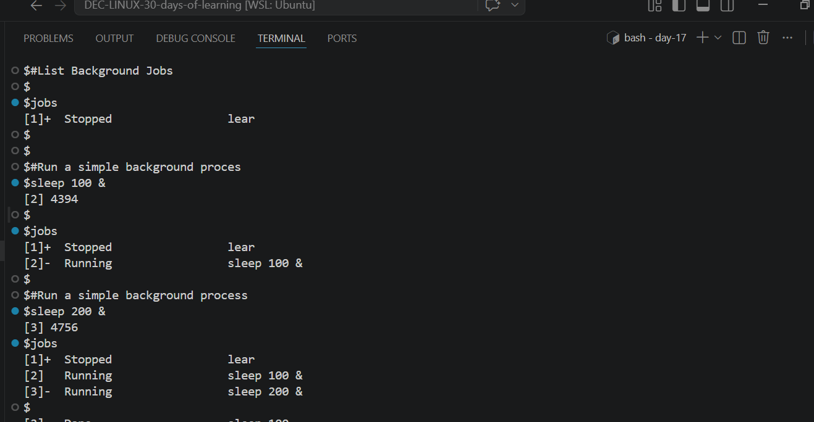
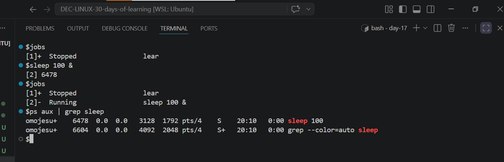

# Day 17 - [UNDERSTANDING PROCESSES IN LINUX]

## Objective

To understand  how Processes works in Linux

---

## What I Learned
- I learnt that in Linux a process is an active instance of a running program
- I leant that every time a command is ran ,a new process is created.
- Key Process identifier(PID,PPID,USID)
- I learnt about Process Lifecycle and States and process transition states are managed by Linux Scheduler
- I learnt about Viewing and Managing Processes
- I learnt about Job Control
- I learnt about how to start and stop processes

---

## What I Built / Practiced

- View Running Processes
- Monitor Processes in Real-Time 
- List Background Jobs
- Run a simple background process

---

## Challenges Faced

- I'm scare to use  kill command
- 

---

## Key Takeaways

- Each command you run creates a process
- Every process has a unique PID (Process ID)
- ps aux command shows all running processes
- top command gives real-time system activity
- Helps you track CPU and memory usage
- Using & lets processes run in the background
- You can continue working without waiting
- kill <PID> command  stops a process safely
- kill -9 <PID> command force stops it when needed
- jobs command shows processes started in your current terminal
- ps command shows all system processes
- Always confirm after killing a process
- Use jobs or ps to ensure only the intended process stopped

---

## Resources

- Github :https://github.com/Najeeb-Sulaiman/linux-and-bash-scripting-guide/blob/main/05-linux-processes/01-understanding-processes.md

---

## Output

- 
- 
- 
