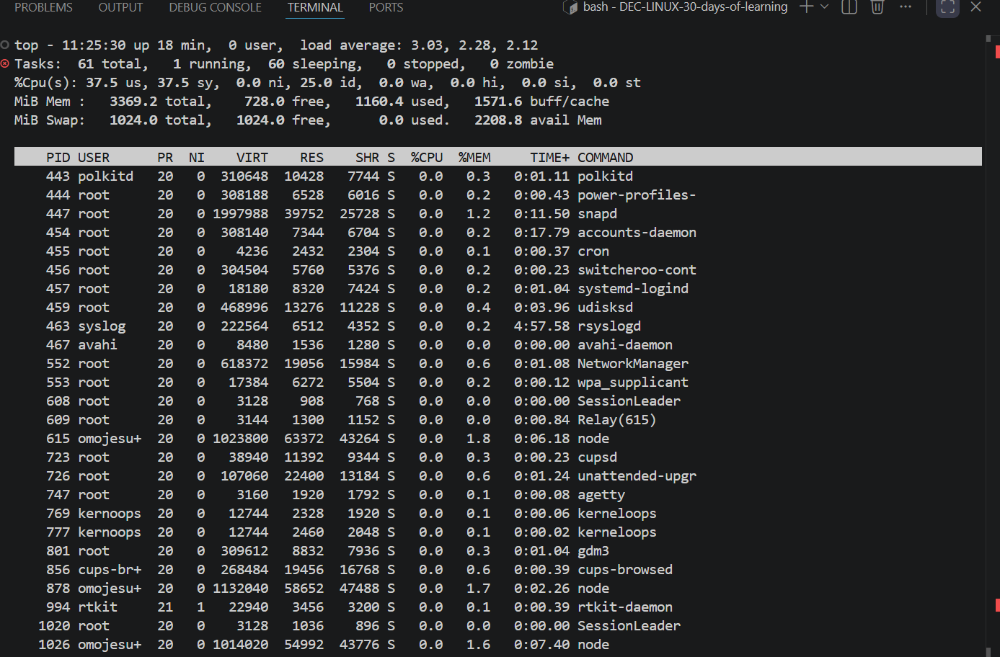
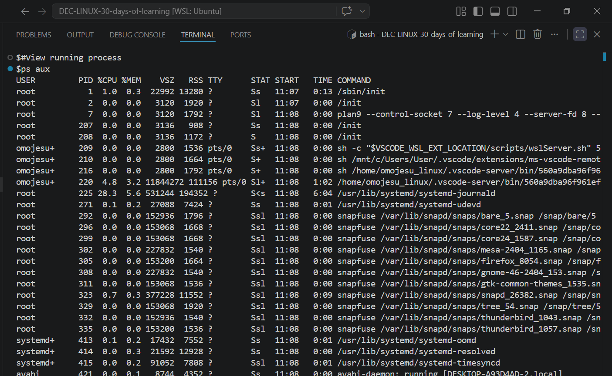
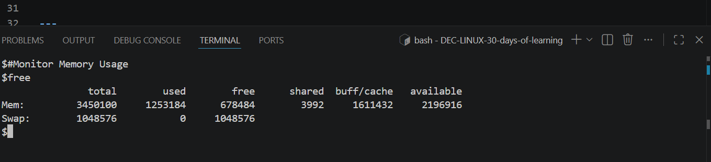
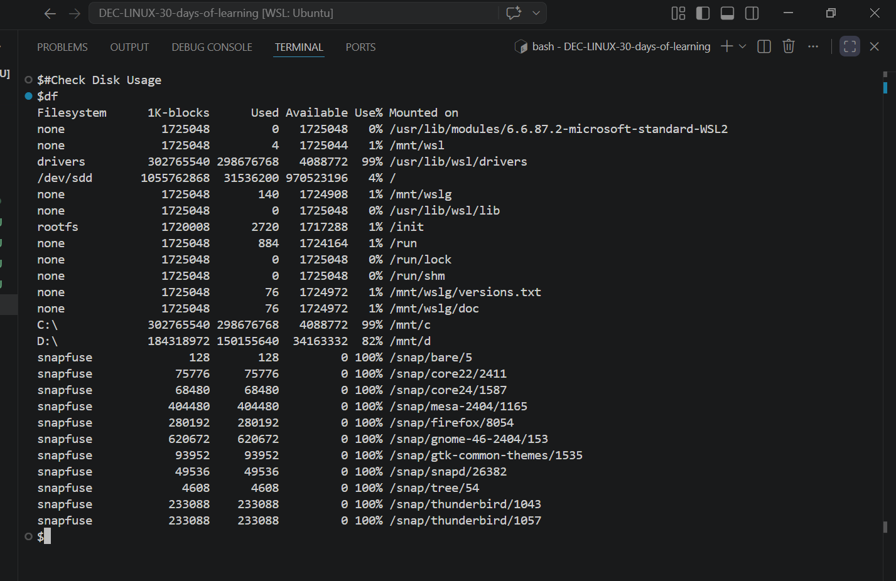
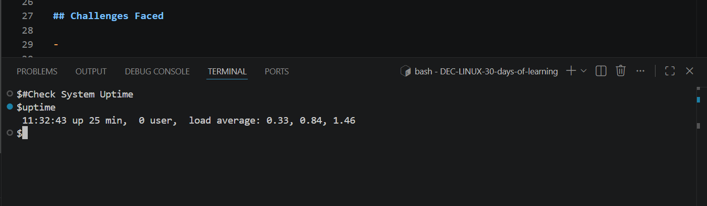

# Day 18 - [System monitoring in linux]

## Objective
To understand System monitoring in linux

---

## What I Learned

- I learnt what System Monitoring in Linux is
- Command Linux used

---

## What I Built / Practiced

- Check System Overview
- View Running Processes
- Monitor Memory Usage
- Check Disk Usage
- Check System Uptime

- 

---

## Challenges Faced

- none 
- 

---

## Key Takeaways

- As a Data Engineer, knowing when to kill, pause, or reschedule jobs improves system reliability.- 

---

## Resources

- website :https://www.geeksforgeeks.org/linux-unix/linux-system-monitoring-commands-and-tools/

---

## Output
- 
- 
- 
- 
- 

