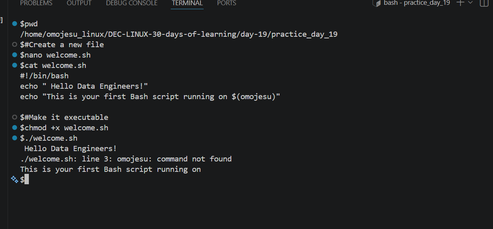
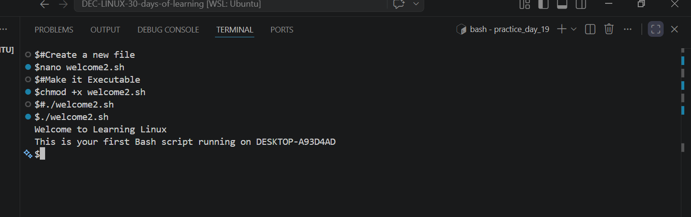

# Day 19 - [Introduction to Bash Scripting]

## Objective

My objectiveis is to understand Introduction to Bash Scripting

---

## What I Learned

- I understood what  is Bash scipt
- Why Data Engineer use Bash Script(which for Data Ingestion,Data Cleaning,ETL Orchestration ,Environment Setup, Monitoring Jobs)
- Basic Bash Structures
- I learnt that some common mistakes needs to be avoided (like Forgetting #!/bin/bash,Missing chmod +x,Using Windows line endings,Not using quotes around variables)
- 

---

## What I Built / Practiced

-  Create a new file
- Add the following content and save the file
- Make it executable
- Run your script
- 

---

## Challenges Faced

- Had litte challenge running the script
- 

---

## Key Takeaways

- Save them in a script
- Run everything with a single command
- Ensure consistency and reduce errors
- 

---

## Resources

- Github : https://github.com/Najeeb-Sulaiman/linux-and-bash-scripting-guide/blob/main/07-bash-scripting/01-overview.md

---

## Output

