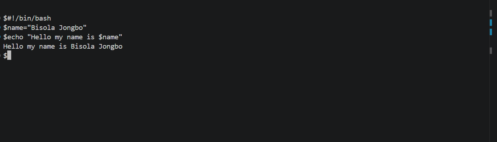
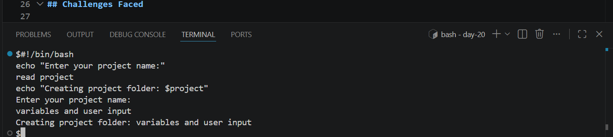
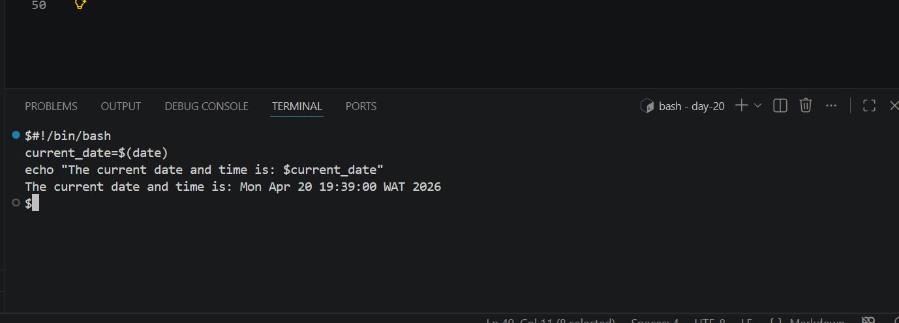
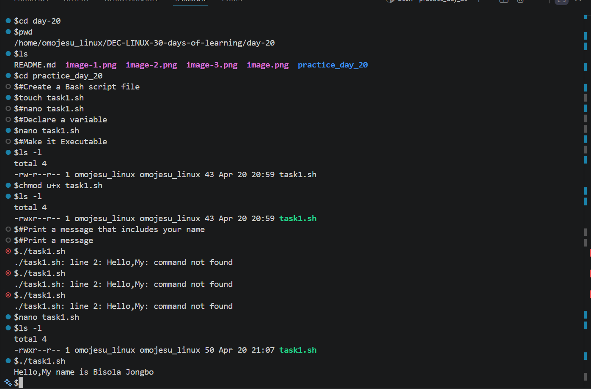

# Day 20 - [Variables and User Input]

## Objective

To understand Variables and User Input

---

## What I Learned

- I learnt how to define variable in Linux
- I learnt how to access variable Using the "$" prefix to retrieve a variable's value.
- I leant how to use scripts to interact with users using the read command.
- 

---

## What I Built / Practiced

- Create a directory called"Practice-day20
- Define a Variable
- Collect User Input

---

## Challenges Faced

- Creating directory  
- Missed chmod +x 
- I had command not found because i didn't use the echo command 

---

## Key Takeaways

- Good variable naming improves readability
- "read" is used to collect user input
- Variables store data for reuse

---

## Resources

- Github :https://github.com/Najeeb-Sulaiman/linux-and-bash-scripting-guide/blob/main/07-bash-scripting/02-variables-and-user-input.md 

---

## Output

