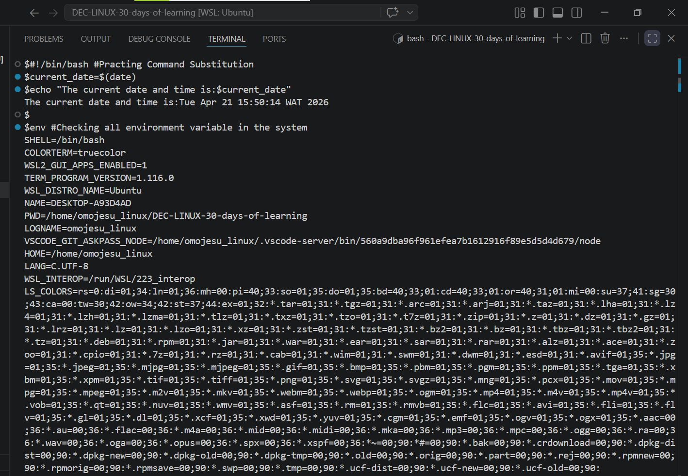
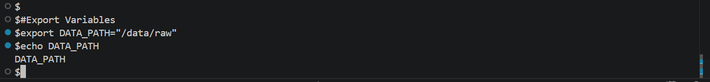
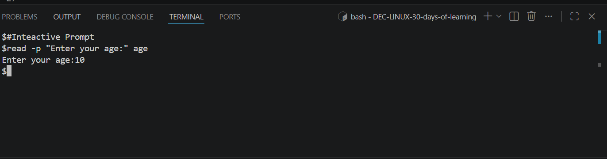
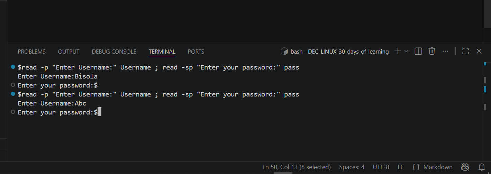

# Day 21 - [Variables and User Input]

## Objective
    To understand Command Substitution,Environment Variables,Exporting Variables and Constants and Read-only Variables
---

## What I Learned

- I learn that Save the output of a command into a variable using $(command).
bash
- I learnt that Environment Variables are in-built variables provided by the system.($USER,$HOSTNAME,$HOME,$PWD, $SHELL)
- I learnt about Exporting Variables 
- I learnt about Constants and Read-Only Variables

---

## What I Built / Practiced

- Practiced Command Substitution
- Checked all environment variable in the system
- Export Variable
- Interactive Prompt
- Slient Input

---

## Challenges Faced

- None
- 

---

## Key Takeaways

- Command Substitution lets you store output command inside a variable
- Environment Variables are built in variable provided by the system

---

## Resources

- GITHUB :https://github.com/Najeeb-Sulaiman/linux-and-bash-scripting-guide/blob/main/07-bash-scripting/02-variables-and-user-input.md

---

## Output
- 
- 
- 
- 
