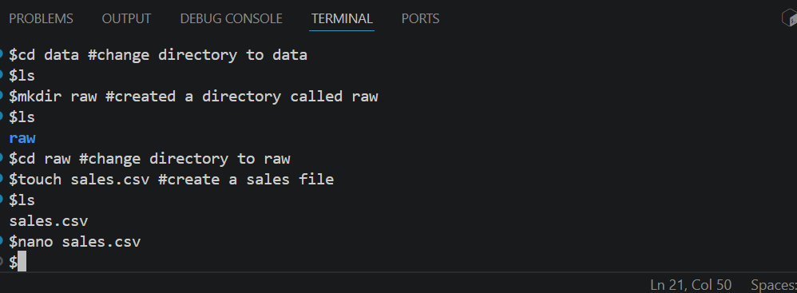
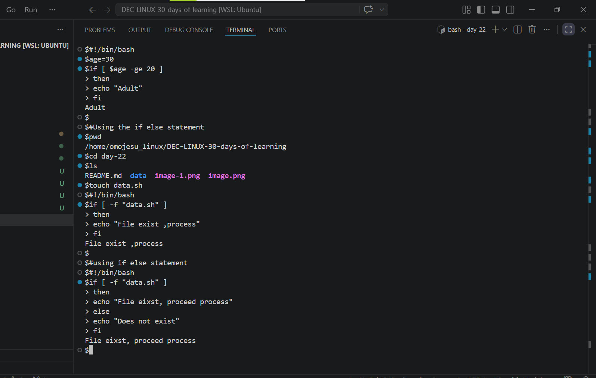

# Day 22 - [Conditional Statements]

## Objective

To understand Conditional Statement in Linux Bash  scripting

---

## What I Learned

- I learnt that , conditional statements allow you to control the flow of a script by executing commands only when specific criteria are met.
- I learnt about if  statement and it structure
-  I learnt about if  statement and it structure

---

## What I Built / Practiced 

- Created two directories(data and raw)
- Created a file
- I checked if sales.csv exist using if statement

---

## Challenges Faced

- Had issue with not seeing the (data/raw) directory  
- 

---

## Key Takeaways

- Conditional statements allow you to control the flow of a script by executing commands only when specific criteria are met.
- 

---

## Resources

-Github:https://github.com/Najeeb-Sulaiman/linux-and-bash-scripting-guide/blob/main/07-bash-scripting/03-conditional-statements.md 

---

## Output

- 
- 
- 