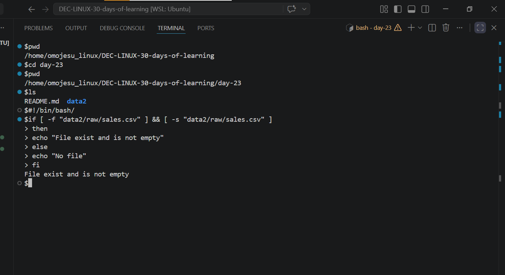
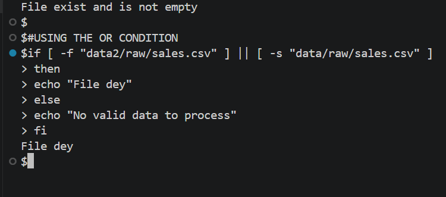
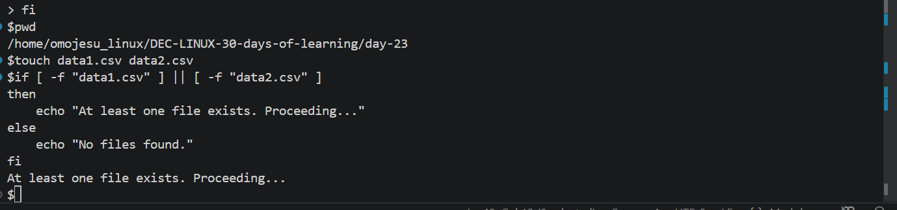

# Day 23 - [Common Conditional Operators and Combining Conditions (AND & OR)]

## Objective

To understand Common Conditional Operators and Combining Conditions (AND & OR)

---

## What I Learned

- I learnt Conditional Operators
-I also  learnt Combining Conditions (AND & OR)
- 

---

## What I Built / Practiced

- Create a directory and file
- I practiced the  conditional operators and combining condition

---

## Challenges Faced

- none
- 

---

## Key Takeaways

- Conditional statements allow you to control the flow of your script, making decisions based on specific conditions.
- 

---

## Resources

- Github: https://github.com/Najeeb-Sulaiman/linux-and-bash-scripting-guide/blob/main/07-bash-scripting/03-conditional-statements.md

---

## Output

- 
- 
- 