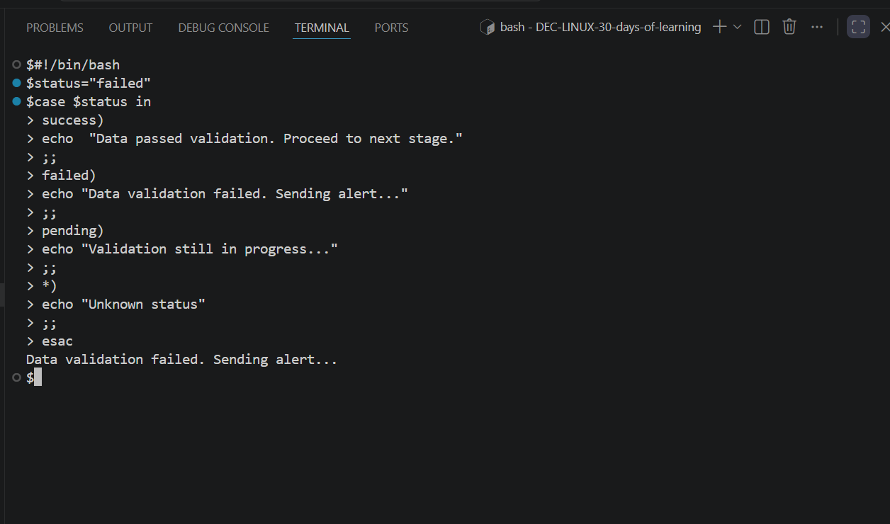
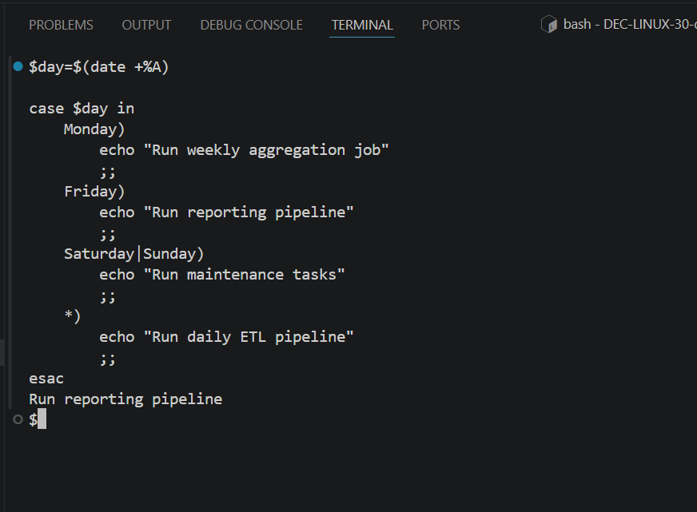
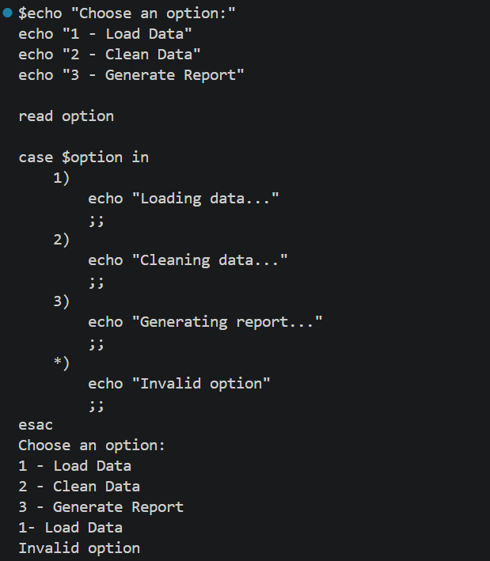
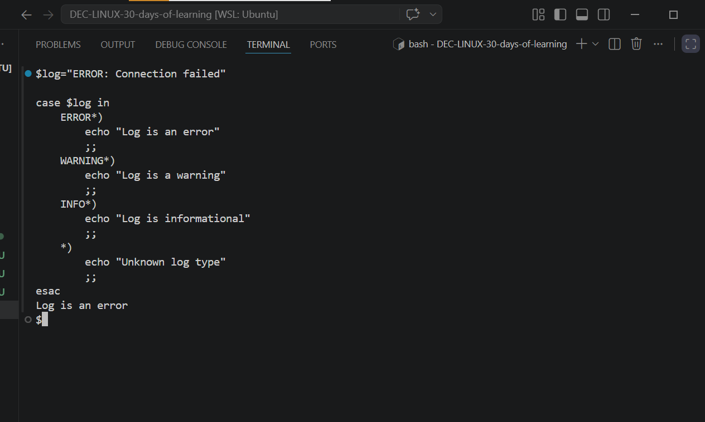

# Day 24 - [The case Statement in Linux]

## Objective

To understand Case Statement

---

## What I Learned

- I learnt that case statement is a powerful tool used to execute different blocks of commands based on whether a variable matches a specific pattern
- I also learnt about the basic syntax
- 

---

## What I Built / Practiced

- I used  case statement for Data Quality Check Status
- Pattern Matching with Prefix (Log Analysis)

---

## Challenges Faced

- 
- 

---

## Key Takeaways

- It improves readability and structure, making your scripts easier to maintain as your data pipelines grow.
- It improves readability and structure, making your scripts easier to maintain

---

## Resources

- Github:https://github.com/Najeeb-Sulaiman/linux-and-bash-scripting-guide/blob/main/07-bash-scripting/03-conditional-statements.md

---

## Output

