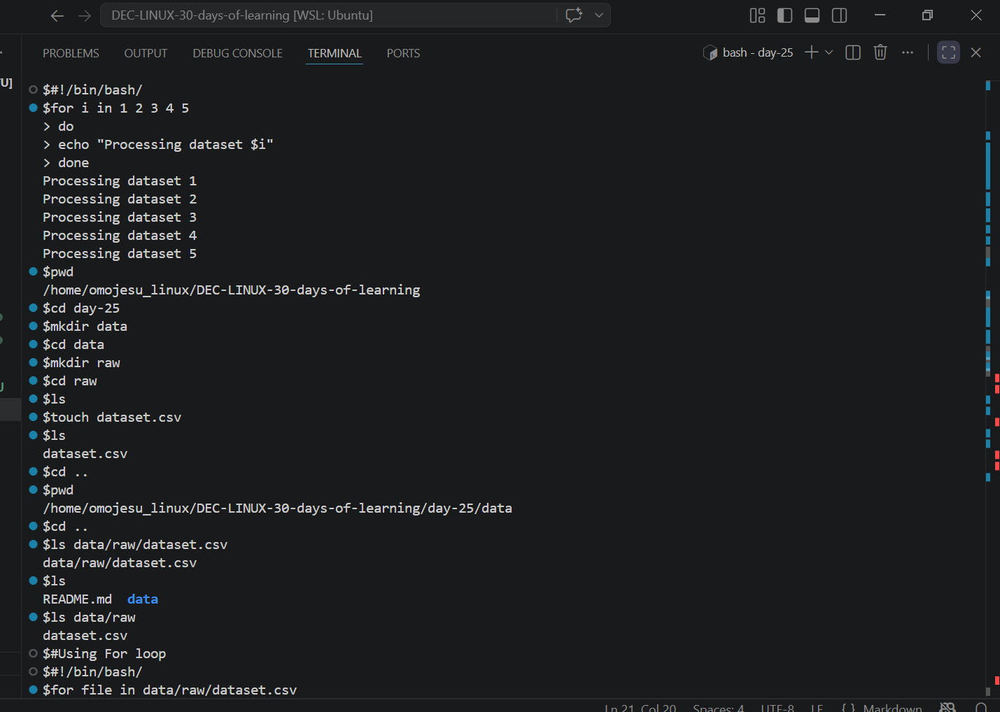
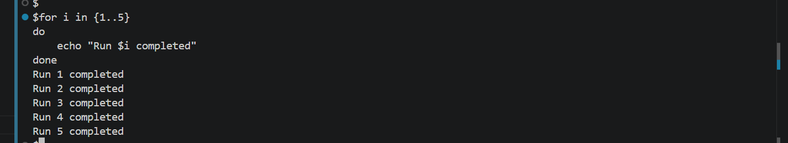
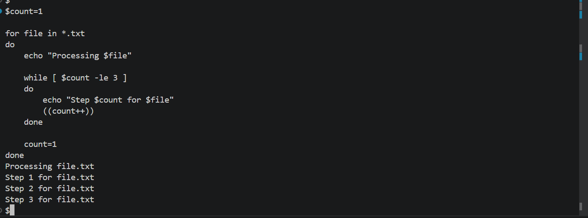
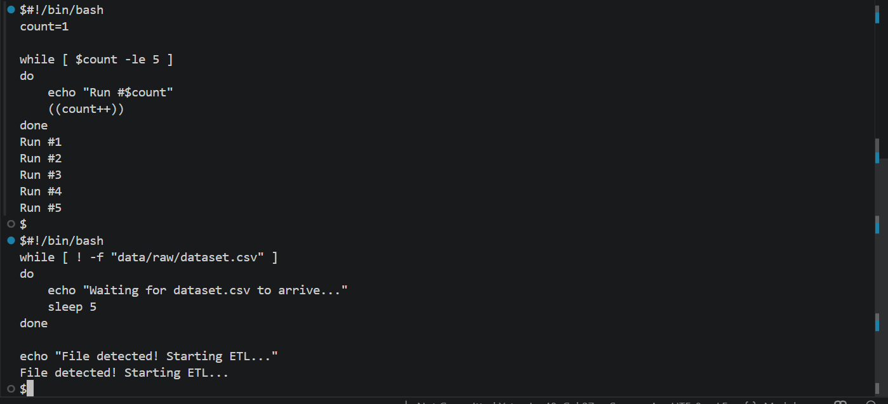
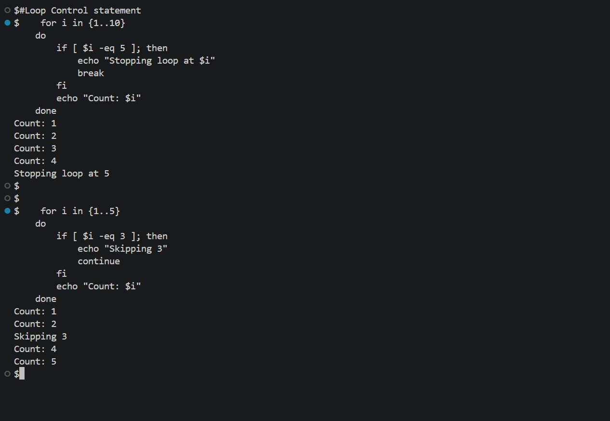
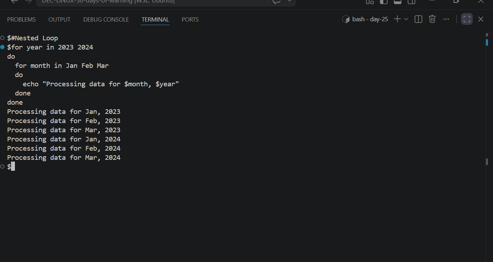

# Day 25 - [Loops in Bash]

## Objective
To understand Loops in Bash

---

## What I Learned

- Learnt that the for loop runs a command for each item in a list. We use it to iterate over a list
- Learnt that the while loop runs as long as a condition is true.
- Learnt about Loop Control Statements(break and contiue)
- 

---

## What I Built / Practiced

- Create Folder Structure 
- Create file
- Practiced the for loop, while loop ,nested loop and loop control statement

---

## Challenges Faced

- none
- 

---

## Key Takeaways

- loops help you automate repetitive tasks 
-

---

## Resources

- Github :https://github.com/Najeeb-Sulaiman/linux-and-bash-scripting-guide/blob/main/07-bash-scripting/04-loops-in-bash.md

---

## Output
- 
- 
- 
- 
- 
- 