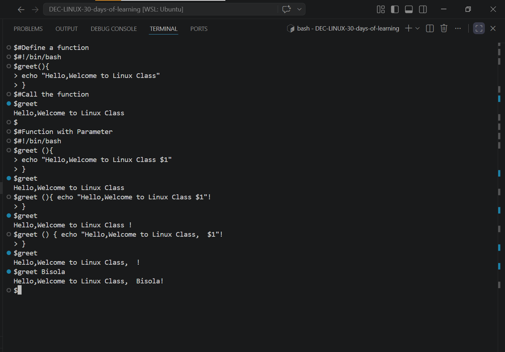
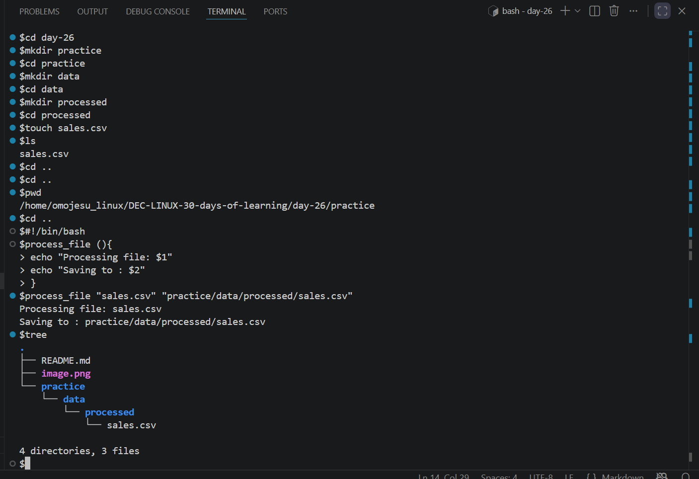

# Day 26 - [Functions and Reusability in Bash]

## Objective

To understand Function in Bash and how to use it

---

## What I Learned

- What is  Function
- Function with Parameter
- I learnt about $1, $2, $3 represent the first, second, and third arguments passed to the function.
- $@ represents all arguments.

---

## What I Built / Practiced

- Create directory and file
-  Define function with parameter

---

## Challenges Faced

- None
- 

---

## Key Takeaways

- Function helps to avoid duplication 
- And make coder cleaner and readable

---

## Resources

- Github :https://github.com/Najeeb-Sulaiman/linux-and-bash-scripting-guide/blob/main/07-bash-scripting/05-functions.md

---

## Output
-  
- 