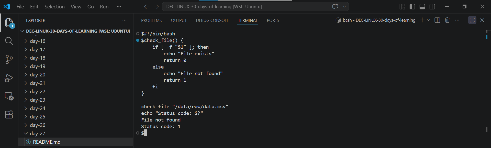
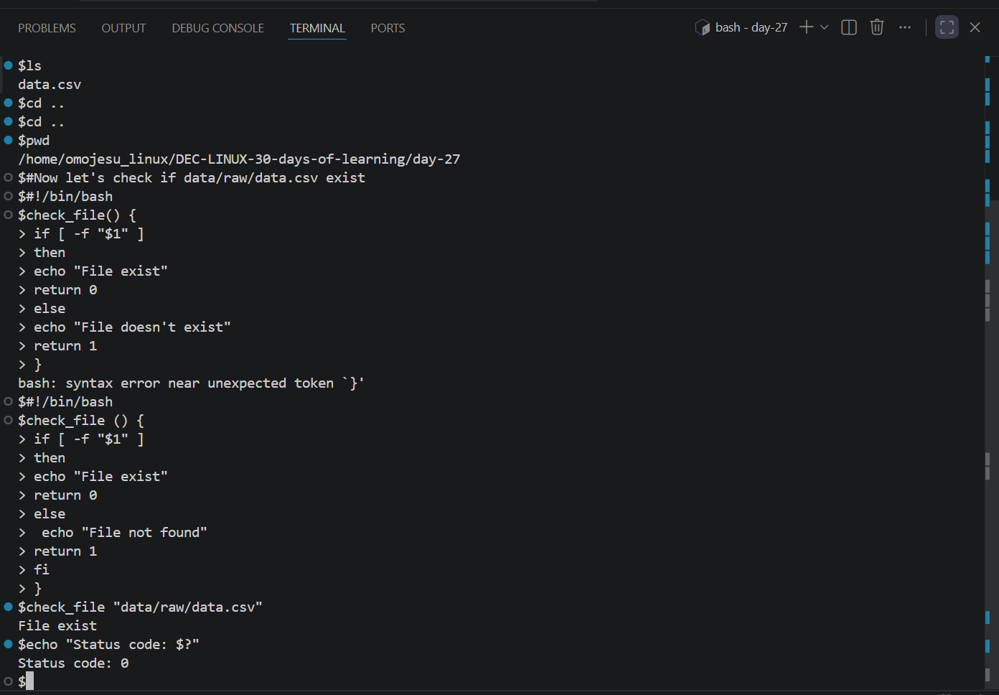
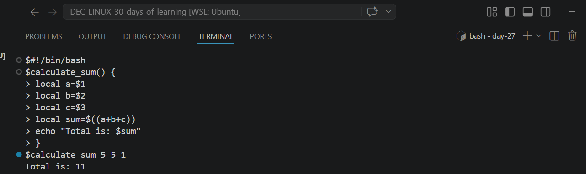

# Day 27 - [Functions and Reusability in Bash contd]

## Objective

My objective is to understand Return Values and Exit Codes and Using Variables Inside Functions

---

## What I Learned

- Functions can return a status code (0 = success, anything else = failure).
-  $? to capture the exit status of the last executed command.
- Variables inside a function are global by default and to create function-specific variables, use the local keyword.

---

## What I Built / Practiced

- I practiced using fuction to return a status code 
- I practiced  creating Variable inside Function

---

## Challenges Faced

- none
- 

---

## Key Takeaways

- Return Values and Exit Codes helps determine success or failure(success means 0 and 1–255 means failure)
- Using local variables inside functions helps you avoid variable conflicts.

---

## Resources

- Github:https://github.com/Najeeb-Sulaiman/linux-and-bash-scripting-guide/blob/main/07-bash-scripting/05-functions.md

---

## Output

-  Fig1. File not found because no  was file created
-  Fig2. File exist because it created
- Fig3.Using Variables Inside Functions
