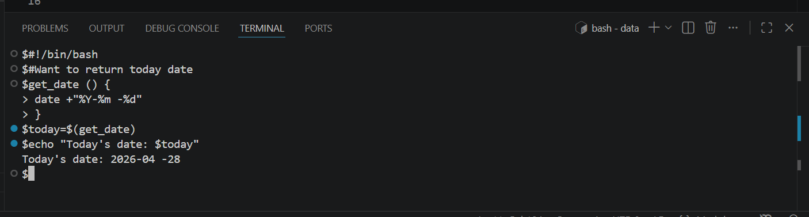
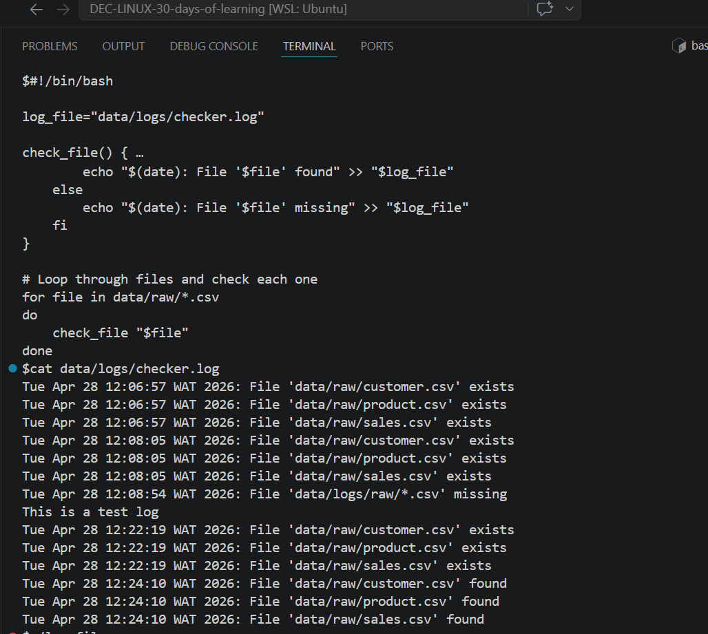
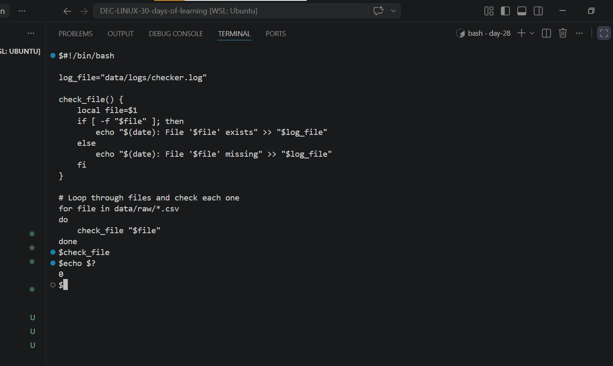
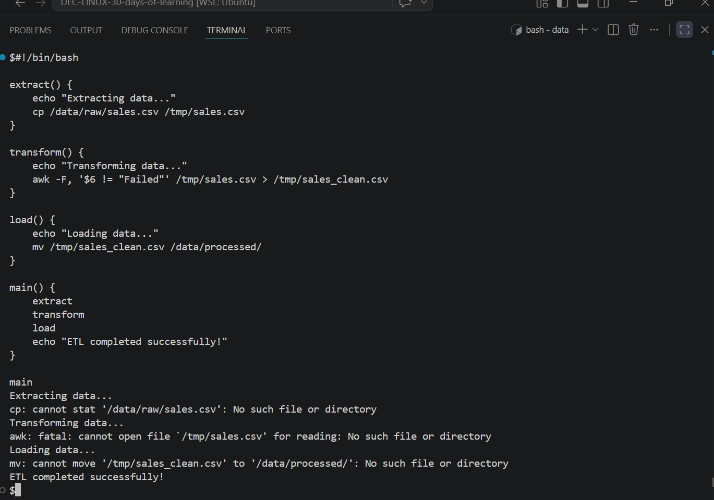
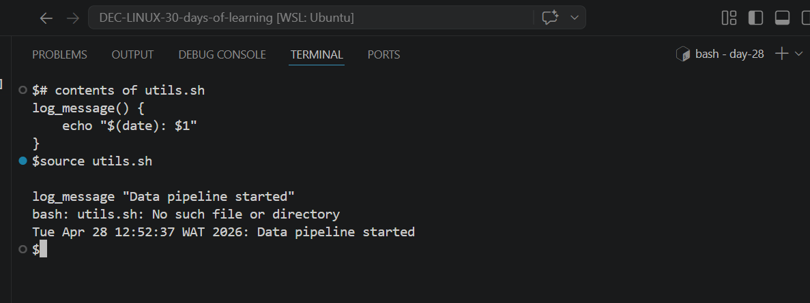

# Day 28 - [Functions That Return Data,Combining Functions for Workflow Automation,Sourcing Functions from Another File]

## Objective

    My objective is to understand Functions That Return Data,Combining Functions for Workflow Automation,Sourcing Functions from Another File 
---

## What I Learned

- I learnt that Functions can “return” data by printing it and capturing the output with command substitution.
- I learnt that source function allows you to import functions and variables from another script into the current shell session.
- I learnt that with combining function you can build end-to-end workflows by chaining multiple functions together, where each function handles one step of a process.

---

## What I Built / Practiced

- I practiced to return data by printing it and capturing the output with command substitution 
- I practiced defining multiple functions for different steps of a process
- I practiced using Sourcing Functions from Another File
 

---

## Challenges Faced

- Command returns nothing
- 

---

## Key Takeaways

- Functions - build reusable logic blocks
- Command substitution - capture outputs as data
- Sourcing - share functions across scripts
- Workflow automation - chain everything into pipelines.

---

## Resources

- Github: https://github.com/Najeeb-Sulaiman/linux-and-bash-scripting-guide/blob/main/07-bash-scripting/05-functions.md 

---

## Output

- 
- 
- 
- 
- 