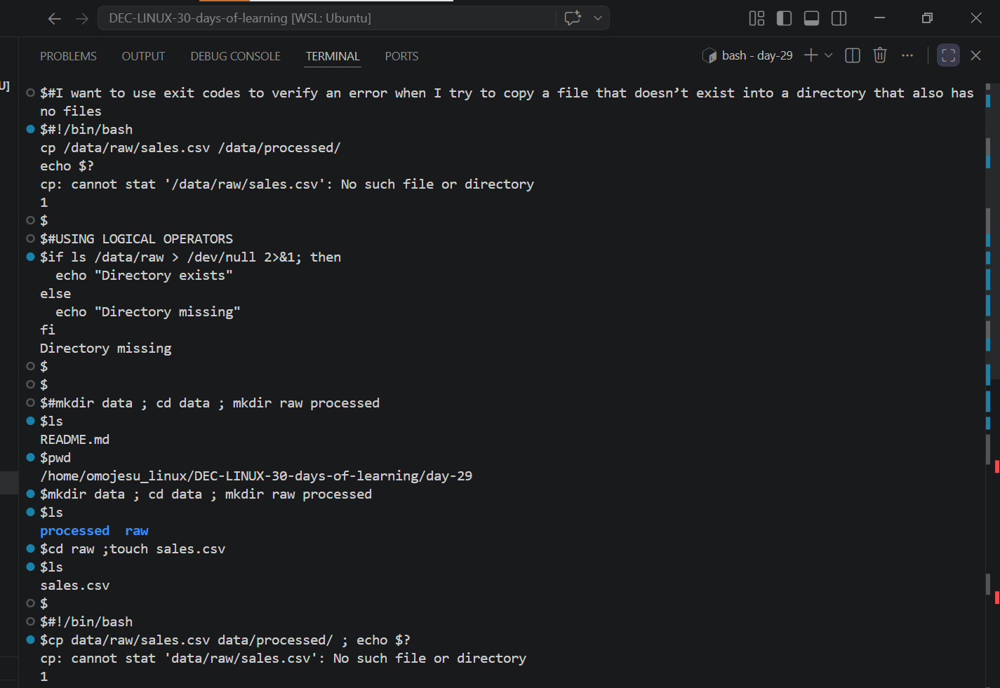
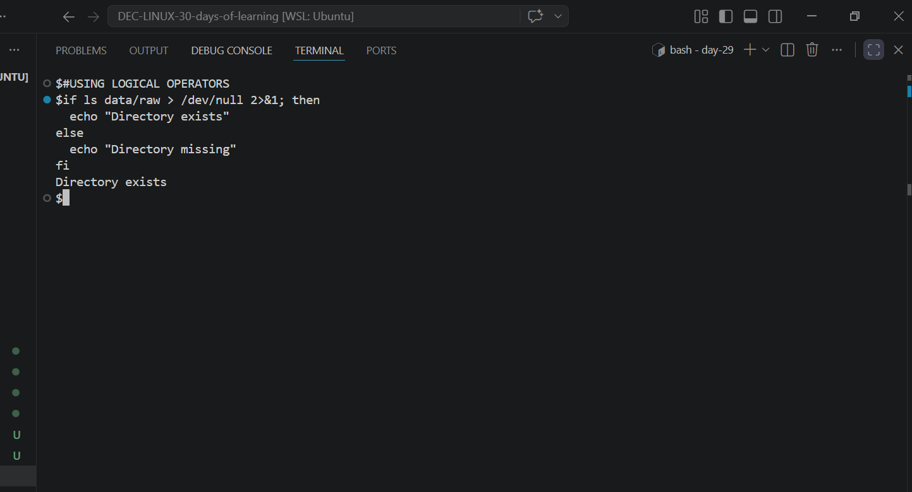
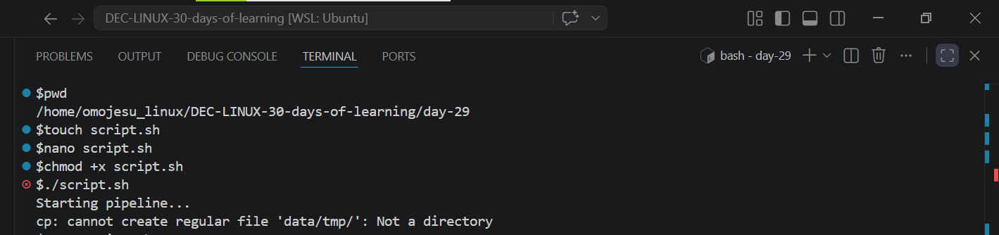
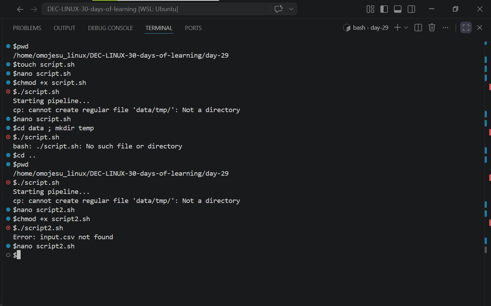
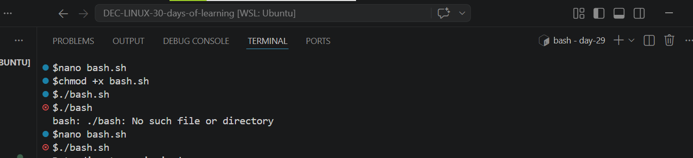
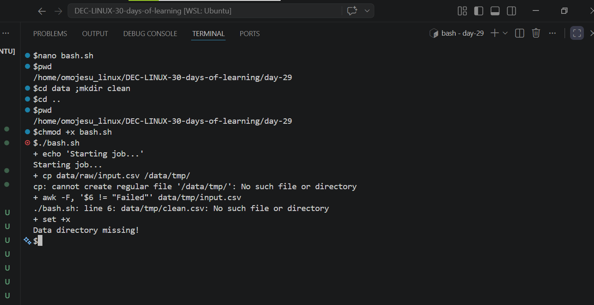

# Day 29 - [Error Handling and Debugging in Bash]

## Objective
My objective is to understand why Error Handling and Debugging in Bash is important 

---

## What I Learned

- I learnt that using exit codes(succeeded (0) or failed (1–255))and logical operators(example && runs the next command only if the previous one succeeds, and || runs a command if the previous one fails.) is a solid way to detect and handle errors in Bash.
- I learnt how to Debug scripts efficiently
- I learnt how to Write reliable Bash scripts for production use
- I also learnt that Without proper error handling, a Bash script can:
    - Continue running after a failure (causing data corruption)
    - Overwrite important files
    - Fail silently (and you won’t even know it happened)

---

## What I Built / Practiced

- I practiced Exit Codes in Bash
- I practiced Stopping Scripts on Error (set -e)
- I practiced Custom Error Messages with exit
- I practiced Enabling Debug Mode (set -x)

---

## Challenges Faced

- One challenge I faced was that when I used the set -e command, my script kept stopping unexpectedly, so I ended up using nano to run and test my code instead.
- 

---

## Key Takeaways

- Good Bash scripting is not just about writing commands it’s about:

    - Detecting failures early
    - Handling them clearly
    - Preventing silent errors
    - Making scripts predictable and safe

---

## Resources

- Github:https://github.com/Najeeb-Sulaiman/linux-and-bash-scripting-guide/blob/main/07-bash-scripting/06-error-handling-and-debugging.mdc

---

## Output
- 
-  
- 
- 
- 
- 
- 