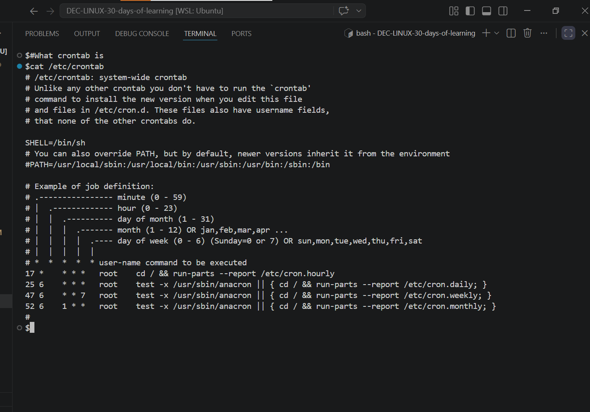
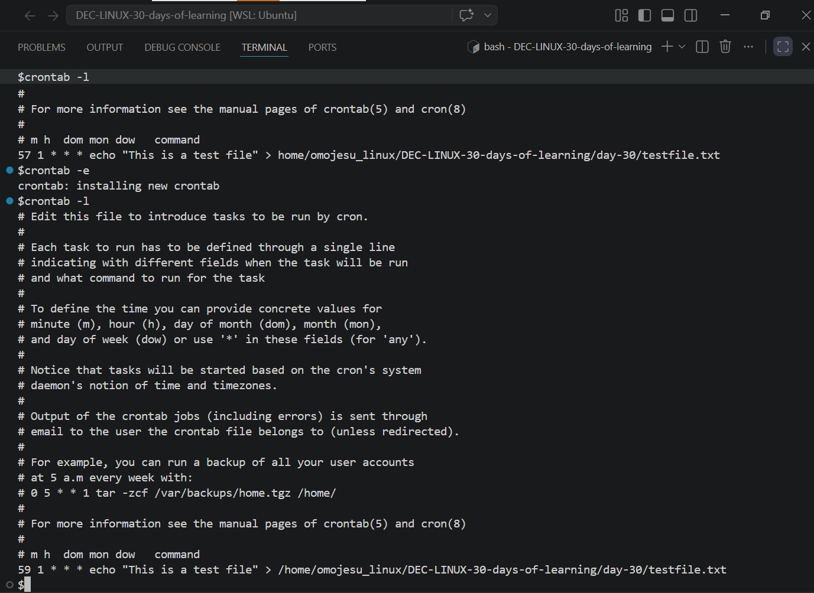
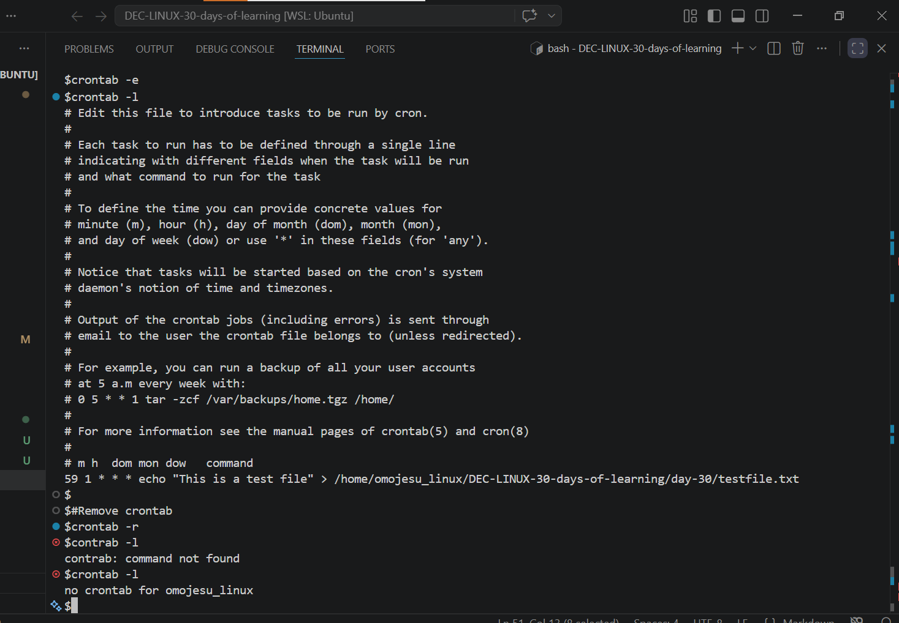
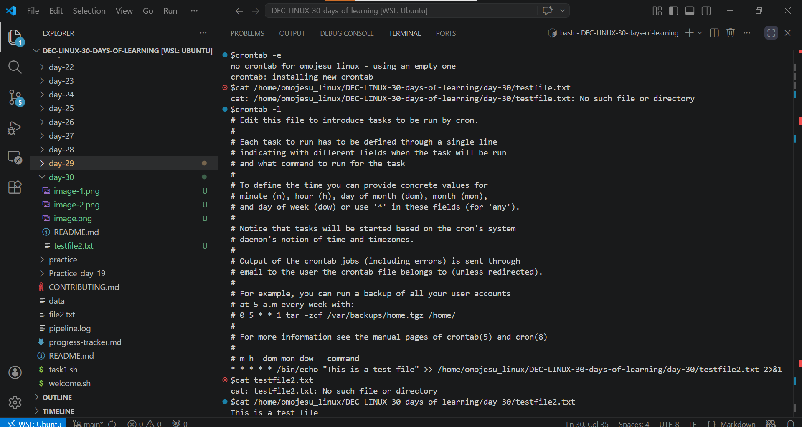

# Day 30 - [Scheduling and Automation with Cron]

## Objective

To understand Scheduling and Automation with Cron and how it works

---

## What I Learned

- I learnt that scheduling and automation is one of the backbones of data engineering
- I learnt what is Cron?
- I learnt about Cron syntax
- I learnt about Managing Cron Jobs
- 

---

## What I Built / Practiced

- I practiced crontab -l to view crontab
- I practiced crontab -e to edit/create crontab
- I practiced sudo crontab -u  root(another user) -e  to edit/create crontab in another user
- I practiced crontab -r to remove crontab

---

## Challenges Faced

- None
- 

---

## Key Takeaways

- Cron is not just about running tasks on time,it’s about building reliable, automated workflows that run consistently without supervision.
- 

---

## Resources

- Github:https://github.com/Najeeb-Sulaiman/linux-and-bash-scripting-guide/blob/main/07-bash-scripting/07-scheduling-with-cron.md

---

## Output

- 
- 
- 
- 